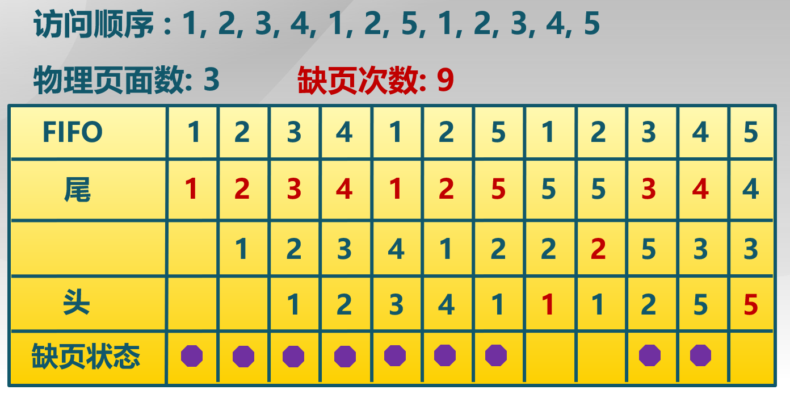
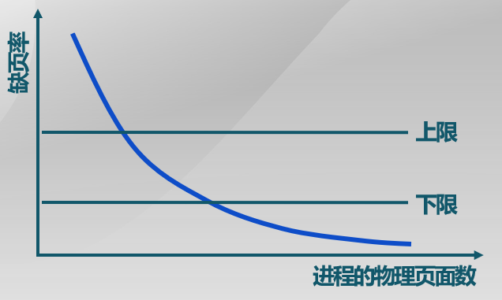

## 置换算法的功能与目标

功能 : 当缺页中断发生， 需要调入新的页面而内存已满时， **选择内存当中哪个物理页面被置换**

设计目标 : 尽可能地**减少**页面的换进换出次数(即缺页中断的次数)，把未来不再访问或短期内不访问的页面换出， 通常只能在局部性原理指导下依据过去的统计数据来进行预测。

**页面锁定** : 描述必须常驻内存的逻辑页面，包括操作系统的关键部分、要求响应速度的代码和数据等。实现的方式是 : 在页表中添加**锁定标记位(lock bit)。**

## 置换算法的评价方法

- 记录一个进程**对页访问的一个轨迹**

 - 举例 : 

   * 虚拟地址跟踪(页号， 偏移)。。。
         	-   (3，0) (1，9) (4，1) (2，1) (5，3) (2，0) 。。。

   -   生成的页面轨迹
       * 3， 1， 4， 2， 5， 2， 1， 。。。

- 模拟一个页面置换的行为并且**记录产生页缺失数的数量**

	-   **更少的缺失， 更好的性能**

## 局部页面置换算法

置换页面的选择范围仅限于当前进程占用的物理页面内

### 最优页面置换算法

基本思路 : 当一个缺页中断发生时， 对于保存在内存当中的每一个逻辑页面， 计算在它的下一次访问之前， 还需等待多长时间，**置换在未来最长时间不访问的页面**

但是，这是一种理想情况， 在实际系统**无法实现**， 无法预知每个页面在下次访问前的等待时间

可用作置换算法的**性能评价的依据**

在一个模拟器上运行某个程序， 并记录每一次的页面访问情况， 在第二遍运行时使用最优算法

### 先进先出算法

基本思路 : 选择在**内存中驻留时间最长**的页面进行置换。

实现：系统维护着一个记录所有位于内存当中的逻辑页面的链表，链表按**驻留内存的时间**排序，**链首最长**。当发生一个缺页中断时， 把链首页面置换出去， 并把新的页面添加到链表的末尾。

实现简单，但性能较差， 调出的页面有可能是经常要访问的页面。进程分配物理页面数增加时，缺页不一定减少（belady现象），该算法很少单独使用。

### 最近最久未使用算法(Least Recently Used，LRU)

基本思路 : 当一个缺页中断发生时， 选择**最长时间没有被引用的页面置换**

它是对最优页面置换算法的一个近似， 其依据是**程序的局部性原理，** 即在最近一小段时间(最近几条指令)内， 如果某些页面被频繁地访问， 那么再将来的一小段时间内， 他们还可能会再一次被频繁地访问。 反过来说， 如果过去某些页面长时间未被访问， 那么在将来它们还可能会长时间地得不到访问。

实现：缺页时，计算内存中每个逻辑页面的**上一次访问时间**，选择**上一次使用到当前时间最长**的页面置换

该算法是**最优置换算法的一种近似**

两种可能的实现**具体方法**是 :

1. 系统维护一个**页面链表**， 按访问时间排序，首节点为最近刚刚使用过的页面。访问内存时， 找出相应的页面，并将其移动到链表首节点。每次缺页中断发生时， 置换链表尾结点的页面

2. 设置一个**活动页面栈**， 当访问某页时， 将此页号压入栈顶， 并将栈内相同页号抽出。缺页时， 置换栈底的页面，它就是最久未使用的。

**LRU问题：开销大**

### 时钟页面置换算法

基本思路 : 仅对页面的访问情况进行大致统计。

数据结构：

* 在页表项增加访问位， 描述页面在过去一段时间的访问情况。
* 把各个页面组织成**环形链表**(类似钟表面)
* 把指针指向最老的页面(**最先调入页面**);

算法：

* 访问页面时，在页表项记录页面的访问情况。
* 当发生缺页中断时， 从指针处开始顺序查找未被访问的页面进行置换
* 是对LRU和FIFO的折中

流程 :

* 页面被装入内存时， 访问位初始化为0。
* 如果这个页面被访问， 则把该位置设为1
* 缺页时，从指针当前位置顺序检查环形链表
  * 访问位0， 替换当前页， 指针指向下一个物理页; 
  * 访问位为1， **该位置零**，指针移动到下一个页面，直到找到可置换的页面。 如果所有物理页的访问位都被清零了， 则又回到了指针第一次所指向的物理页进行替换。

### 改进的Clock算法（二次机会算法）

因为考虑到时钟页面置换算法， 有时候会把一些 修改位dirty bit 为1的页面进行置换， 这样的话， 代价会比较大，**因为还要将修改写入外存，时间大致会翻倍**。 因此， 可以结合访问位和修改一起来决定应该置换哪一页。**从而减少修改页的缺页处理开销**

相当于说，如果没有读过也没写过， 那么直接被置换， 如果写过或者访问过， 那么给一次机会， 如果又写过， 又访问过， 那么给两次机会。

这样缺页中断时，对于修改过的页面处理速度比原来快：延迟之后，后续有可能的改动页面写出它可能会被合并或延时。

### 最不常用算法（Least Frequently used， LFU）

基本思路 : 当一个缺页中断发生时， 选择**访问次数最少**的那个页面置换。

实现方法 : 对每一个页面设置一个**访问计数器**， 每当一个页面被访问时， 该页面的访问计数器加1。 当发生缺页中断时， 置换计数最小的页面。

特征：

* 算法开销大
* 开始时使用频繁，但以后不使用的页面很难置换
  * 解决办法：**计数定期右移**

LRU和LFU的对比 : 

* **LRU关注多久未访问**， 时间越短越好。 
* **LFU关注访问的次数**，次数越多越好。

### Belady现象

在采用FIFO等算法时，有时会出现分配的物理页面数增加， **缺页率反而提高的异常现象**;

出现原因 : FIFO算法的**置换特征与进程访问内存的动态特征是矛盾的**， 与置换算法的目标是不一致的(即替换较少使用的页面)，  被置换出去的页面不一定是进程近期不会访问的。

例子：

> 

>  

可以证明出，**LRU算法没有Belady现象**

### LRU / FIFO 和 Clock 的比较

* LRU和FIFO都是**先进先出**的思路 

  * LRU是针对页面最近访问时间来进行排序， 所以需要在每一次页面访问的时候动态地调整各个页面之间的先后顺序。 

  * FIFO是针对页面进入内存的时间来进行排序， 这个时间是固定不变的， 所以各个页面之间的先后顺序是固定的。

  * LRU退化为FIFO： **如果一个页面在进入内存后没有被访问， 那么它的最近访问时间就是它进入内存的时间**。 换句话说， 如果内存当中的所有页面都未曾访问过， 那么LRU算法就退化为了FIFO算法。

  * 例如 : 给进程分配3个物理页面， 逻辑页面的访问顺序是 : 1，2，3，4，5，6，1，2，3 ...
* LRU算法性能较好，但系统开销较大
* FIFO算法系统开销较小，会发生Belady现象
* Clock算法是它们的折衷
  * 页面访问时，不动态调整页面在链表中的顺序，仅做标记
  * 缺页时，再把它移动到链表末尾
* 对于**未被访问**的页面，Clock和LRU算法的表现一样好
* 对于**被访问过**的页面，Clock算法不能记录准确访问顺序，而LRU算法可以

## 全局页面置换算法

置换页面的选择范围是所有可换出的物理页面，**局部页面置换算法没有考虑进程访存差异**，也就是说，某些情况下，多给进程增加一个物理页面，可能缺页率就会大幅下降

思路：为进程分配**可变数目**的物理页面

全局置换算法那要解决的问题：

* 进程在不同阶段的内存需求是变化的
* 分配给进程的内存也需要在不同阶段有所变化
* 全局置换算法需要确定分配给进程的物理页面数

CPU利用率和并发进程数的关系：（**促进和制约**）

### 工作集模型

前面介绍的各种页面置换算法， 都是基于一个前提， 即程序的局部性原理。 但是此原理是否成立?

-   如果局部性原理不成立， 那么各种页面置换算法就没有说明分别， 也没有什么意义。 例如 : 假设进程对逻辑页面的访问顺序是1，2，3，4，5，6，6，7，8，9。。。， 即单调递增， 那么在物理页面数有限的前提下， 不管采用何种置换算法， 每次的页面访问都必然导致缺页中断。
-   如果局部性原理是成立的， 那么如何来证明它的存在， 如何来对它进行定量地分析? 这就是工作集模型。

### 工作集

工作集 : 一个进程**当前**正在使用的逻辑页面集合，可以使用一个**二元函数 W(t，Δ)** 来表示 :

* t 是当前的执行时刻;

* Δ称为**工作集窗口**， 即一个定长的页面访问的时间窗口;

* W(t，Δ) = 在当前时刻 t 之前的Δ时间窗口当中的所有页面所组成的集合(随着 t 的变化， 该集合也在不断的变化)

* |W(t，Δ)| 是工作集的大小， 即逻辑页的数量。

工作集的变化 : 

* 进程开始执行后， 随着访问新页面逐步建立较稳定的工作集。 
* 当内存访问的局部性区域的位置**大致稳定**时， 工作集大小也大致稳定
* 局部性区域的位置改变时， 工作集**快速扩张和收缩**过渡到下一个稳定值。

### 常驻集

常驻集是指在当前时刻， 进程**实际驻留**在内存当中的页面集合。

工作集和常驻集的关系：

-   工作集是进程在运行过程中固有的性质， 
-   常驻集取决于系统分配给进程的**物理页面数目**和**所采用的页面置换算法**;

缺页率和常驻集的关系：

* 常驻集包含工作集时，缺页较少
* 工作集发生剧烈变动（过渡）时，缺页较多

-   进程常驻集的大小达到某个数目之后， 再给它分配更多的物理页面， 缺页率也不会明显下降。

### 工作集页置换算法

思路：换出不在工作集的页面

实现方法：

* **访存链表**：维护窗口内的访存页面链表
* 访存时，换出不在工作集的页面；更新访存链表
* 缺页时，换入页面；更新访存链表

### 缺页率置换算法

缺页率 :  缺页次数 / 内存访问次数 或 缺页平均时间间隔的倒数

影响因素 : 

* 页面置换算法
* 分配给进程的物理页面数目
* 页面本身的大小
* 程序的编写方法。

通过**调节常驻集大小**，使每个进程的缺页率保持在一个合理的范围内

* 若进程缺页率过高，则增加常驻集以**分配更多**的物理页面
* 若进程缺页率过低，则减少常驻集以**减少**它的物理页面数

缺页率置换算法的实现：

* 访存时，设置**引用位**标志
* 缺页时，计算从上次缺页时间*t*last到现在*t*current的时间间隔
  * 如果*t*current－*t*last > T，则**置换所有**在[*t*last, *t*current]时间内**没有被引用的页**
  * 如果*t*current－*t*last ≤ T，则**直接增加**缺失页到工作集中

示例：

### 抖动问题

-   **抖动**：如果分配给一个进程的物理页面**太少**， **不能包含整个的工作集**， 即常驻集小于工作集， 那么进程将会造成大量缺页，需要频繁置换， 从而使进程的运行速度变得很慢。
-   产生抖动的**原因** : 
    * 随着驻留内存的**进程数目增加**，分配给每个进程的物理页面数不断就减小，导致缺页率不断上升 
    * 因而，操作系统需要在**并发水平和缺页率**之间达到一个**平衡**。
      * 选择一个适当的进程数目和进程需要的物理帧数

### 负载控制

通过调节并发进程数（MPL）来进行系统负载控制

* 希望整个内存的总量等于当前运行的各个进程的工作集综合，即∑ WSi = 内存的大小
* 因为第一条要求对应的点位很难获得，故希望平均缺页间隔时间(MTBF)= 缺页异常处理时间(PFST)
* 注：间隔大于处理时间，处理来得及完成，反之，系统将忙不过来
* 能找到的负载均衡的平衡点就是下图两虚线间的区域

