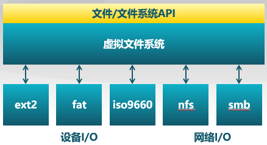

## 基本概念

### 文件系统和文件

文件系统是操作系统中**管理持久性数据**的子系统

-   在存储上: 组织，检索，读写访问数据
-   在大多数计算机系统包含文件系统
-   google可能也是由一个文件系统构成的

文件是具有符号名，由**字节序列**构成的**数据项集合**，为文件系统的**基本数据单位**，文件名是文件的标识符号

#### 文件系统的功能

-   分配文件磁盘空间
    -   管理文件块(位置和顺序)
    -   管理空闲空间(位置)
    -   分配算法(策略)
-   管理文件集合
    -   **定位**文件及其内容
    -   **命名**: 通过名字找到文件的接口
    -   最常见: 分层文件系统
    -   文件**系统结构**：文件组织方式
-   数据可靠与安全
    -   安全: 多层次来保护数据安全
    -   可靠性,持久性: 保持文件的持久即使发生崩溃,媒体错误,攻击等

文件属性: 名称,类型,位置,大小,保护,创建者,创建时间,最久修改时间...

文件头: 文件系统**元数据中的文件信息**，保存文件的属性，跟踪哪一块存储块属于逻辑上文件结构的哪个偏移

### 文件描述符

#### 打开文件和文件描述符

使用程序必须在使用前先"打开"文件

```cpp
f = open(name, flag);
...
read(f, ...);
...
close(f);
```

内核跟踪每个进程打开的文件:

-   操作系统为**每个进程维护一个打开文件表**
-   **文件描述符是打开文件的标识**


操作系统在打开文件表中维护的打开文件状态和信息：

* **文件指针**: 指向**最近的一次读写位置**,每个打开了这个文件的进程都这个指针

* **文件打开计数**: 记录**文件打开的次数** ，当最后一个进程关闭了文件时,允许将其从打开文件表中移除

* **文件磁盘位置**: **缓存数据访问信息**

* **访问权限**: 每个程序**访问模式信息**

#### 用户视图和系统视图

用户视图: 

* 持久的数据结构，指的是用户进程看到的文件是什么样的

系统访问接口:

* 字节的集合(UNIX)

* 系统不会关心你想存储在磁盘上的任何的数据结构，这是**应用进程才需要关心**的

操作系统文件视图:

* 数据块的集合
* 数据块是逻辑转换单元,而扇区是物理存储单元

* 块大小≠扇区大小，**通常是几个扇区构成一个数据块**，在UNIX中, 块的大小是 4KB

#### 用户视图到系统视图的转换

文件系统中的**基本操作单位是数据块**，因而即使每次只读/写一字节数据，也需要将整块数据读出来


即使每次只访问1字节的数据,也会缓存目标数据4096字节(一个磁盘块)

#### 访问模式

操作系统需要了解进程如何访问文件

* **顺序访问:** 按字节依次读取(大多数访问都是这种方式)

* **随机访问:** 从中间读写(不常用,但是仍然重要,如: 虚拟内存支持文件,内存页存储在文件中;更加快速,不希望获取文件中间的内容的时候也必须先获取块内所有字节)

* **索引访问:** 通过数据特征索引，数据库就是建立在索引内容的磁盘访问上

#### 文件内部结构

无结构: 单词，字节序列

简单记录结构: 列,固定长度,可变长度

复杂结构: 格式化的文档(word, PDF), 可执行文件, ...

#### 文件共享和访问控制

**多用户系统中**的文件共享是很必要的

访问控制:

* 谁能够获得哪些文件的哪些访问权限

* 访问模式: 读,写,执行,删除,列举等

文件访问控制列表(ACL):

* <文件实体, 权限>

UNIX模式下：

* <用户|组|所有人,读|写|可执行> w:4,r:2,x:1

* 用户ID识别用户,表明每个用户所允许的权限及保护模式

* 组ID:允许用户组成组,并指定了组访问权限

#### 语义一致性

规定多进程如何同时访问共享文件:

* 和过程同步算法相似

* 因磁盘IO和网络延迟而设计简单

UNIX文件系统(UFS)语义:

* 对打开文件的写入内容**立即**对其他打开同一文件的其他用户可见

* 共享文件指针允许**多用户同时读取和写入文件**，读写是否有问题需要程序自行判断

会话语义:

* 写入内容只有当文件关闭时可见

读写锁:

* 一些操作系统和文件系统提供该功能

### 目录

分层文件系统：文件以目录的方式组织起来

**<font color='red'>目录是一类特殊的文件</font>**: 

* 每个目录都包含了一张索引表<文件名，指向文件的指针>

目录和文件的**树形结构**: 早期的文件系统是**扁平的**(只有一层目录)

层次名称空间: /spell/mail/prt/first  /programs/p/list

典型操作:

* 搜索文件

* 创建文件

* 删除文件

* 列目录

* 重命名文件

* 在文件系统中遍历一个路径

操作系统应该**只允许内核模式修改目录**: 

* 确保映射的完整性
* 应用程序通过系统调用访问目录（ls）

#### 目录实现

1.文件名的**线性列表**,包含了指向数据块的指针

* 编程简单
* 执行耗时

2.Hash表 - **hash数据结构的线性表**

* 减少目录搜索时间
* 冲突 - 两个文件名的哈希值相同
* 固定大小

#### 文件别名

两个或多个文件名**关联同一个文件**：<font color='orange'>为了方便共享，减少存储空间</font>

具体实现办法：

* 硬链接：多个文件项**指向一个文件**
  * 只有**所有文件名都被删除了**文件才实实在在被删除
* 软链接：以“**快捷方式**”指向其他文件
  * 通过存储真实文件的逻辑名称来实现
  * **删除别名，原来文件不受影响**；删除原文件名，别名成为悬空指针

#### 文件目录的循环


如何保证没有循环呢?

* 只允许到文件的链接, 不允许在子目录的链接

* 每增加一个新的链接都用循环检测算法确定是否合理

* 实际做法：限制路径可遍历文件目录的数量

#### 名字解析（路径遍历）

逻辑名字转换成物理资源(如文件)的过程:

* 在文件系统中找到实际文件位置

* 遍历文件目录直到找到目标文件

举例: 解析"/bin/ls":

* 读取root的文件头(在磁盘固定位置)

* 读取root的数据块: 搜索bin项

* 读取bin的文件头

* 读取bin的数据块: 搜索ls项

* 读取ls的文件头

当前工作目录（PWD）:

* 每个进程都会指向一个文件目录用于解析文件名

* 允许用户指定**相对路径**来代替绝对路径

### 文件系统挂载

一个文件系统需要先挂载才能被访问，具体就是将一个未挂载的文件系统挂载在**挂载点**上


### 文件系统种类

1.**磁盘文件系统**: 文件存储在数据存储设备上,如磁盘; 例如: FAT,NTFS,ext2,3,ISO9660等，有各自不同的优化，安全要求也不同

**2.数据库文件系统**: 文件根据其特征是**可被寻址**的; 例如: WinFS

3.**日志文件系统**: 记录文件系统的修改/事件; 例如: journaling file system

4.**网络/分布式文件系统**: 例如: NFS,SMB,AFS,GFS

* 文件可以通过网络被共享
  * 文件位于远程服务器
  * 客户端**远程挂载**在服务器文件系统
  * 标准系统文件访问被转换成远程访问
  * 标准文件共享协议，NFS for Unix, CIFS for Windows
* 面临的挑战
  * 客户端和客户端上的用户辨别起来很复杂
  * **一致性**问题
  * 错误处理模式

**5.特殊/虚拟文件系统**


## 虚拟文件系统

分层结构:

顶层: 文件,文件系统API

上层: 虚拟(逻辑)文件系统 (将所有设备IO,网络IO全抽象成为文件,使得接口一致)

底层: 特定文件系统模块



虚拟文件系统目的: **对所有不同文件系统的抽象**

功能:

* 提供相同的文件和文件系统接口

* 管理所有文件和文件系统关联的数据结构

* 高效查询例程,遍历文件系统

* 与特定文件系统模块的交互

数据结构:

1.**文件卷控制块**(UNIX: "**superblock**")

* 每个**文件系统**一个

* 文件系统详细信息

* 块,块大小,空余块,计数,指针等

2.**文件控制块**(UNIX: "vnode" or "**inode**")

* 每个**文件**一个

* 文件详细信息

* 访问权限,拥有者,大小,数据库位置等

3.**目录节点**(Linux: "dentry")

* 每个**目录项**一个(目录和文件)

* 将目录项数据结构及树形布局编码成树形数据结构

* 指向文件控制块,父节点,项目列表等

其中: **卷控制块(每个文件系统一个),文件控制块(每个文件一个),目录节点(每个目录项一个)**

持续存储在外存中: 存储设备的数据块中

当需要时加载进内存

* 卷控制块: 当文件系统挂载时进入内存

* 文件控制块: 当文件被访问时进入内存

* 目录节点: 在遍历一个文件路径时进入内存

#### 文件系统的存储视图


## 文件缓存

### 数据块缓存

数据块**按需读入内存**:

* 提供 `read()` 操作

* 预读: 预先读取后面的数据块

数据块使用后被缓存:

* 假设数据将会再次被使用

* 写操作可能被缓存和延迟写入

两种数据块缓存方式:（有很强的相似性和关联性）

* **数据块缓存**


* **页缓存：统一缓存数据块和内存页**


文件的读写**转变成对内存的访问**

页面置换算法要**协调**虚拟存储和页缓存的页面数

## 打开文件的数据结构

打开文件描述:

* 每个被打开的文件都有一个**文件描述符**

* 文件状态信息
  * 目录项,当前文件指针,文件操作设置等

打开文件表:
* **一个进程一个**

* 整个系统有一个系统级的打开文件表

* 如果有文件被打开文件卷将不能被卸载

打开文件锁：

* 一些文件系统提供文件锁，用于协调多进程文件访问，实现策略：
  * **强制** - 根据锁保持情况和访问需求确定是否拒绝访问
  * **劝告** – 进程可以查找锁的状态来决定怎么做

## 文件分配

大多数文件都很小：需要对小文件提供好的支持，且块空间不能太大

一些文件非常大：必须支持大文件(64-bit 文件偏移)，且大文件访问需要相当高效

分配方式:

* **连续分配**

* **链式分配**

* **索引分配**

指标:

* 高效: 存储效率，如外部碎片

* 表现: 读写性能，如访问速度

### 连续分配

**文件头指定起始块和长度**

分配策略: 

* 最先匹配,最佳匹配,...

优势: 

* 文件读取表现好
* 高效的顺序和随机访问

劣势: 

* 碎片
* 文件增长问题
  * 预分配
  * 按需分配

### 链式分配

文件以**数据块链表**方式存储

文件头包含了到**第一块和最后一块**的指针

优势: 

* 创建,增大,缩小很容易
* 没有碎片

劣势: 

* 不可能进行真正的随机访问
* 可靠性差
  * 破坏一个链，整个数据出问题

### 索引分配

为每个文件创建一个名为**索引数据块**的非数据数据块

* 指向文件数据块的**指针列表**

**文件头包含了索引数据块**

优势: 

* 创建,增大,缩小很容易
* 没有碎片
* 支持直接访问

劣势: 

* 当文件很小时,存储索引的开销大
* 处理大文件难

#### 大文件的索引分配

链式索引块、多级索引块

#### UFS多级索引分配

**文件头包含13个指针**

* 10指针指向数据块
* 第11个指针指向索引块
* 第12个指针指向二级索引块
* 第13个指针指向三级索引块

效果：

* **提高文件大小阈值**
* 动态分配数据块，文件扩展容易
* 小文件开销小
* **只为大文件分配间接数据块**，大文件在访问数据块时需要大量查询


## 空闲空间管理

跟踪在存储中的所有**未分配**的数据块

### 空闲空间组织：位图

空闲空间列表的最佳数据结构怎么样?

用位图代表**空闲数据块列表:** 

* 1111111111011101111111001...
* 如果Di= 0表明数据块i是**空闲**的,反之是分配的

使用简单但是**可能会是一个很大的向量表**:

* 160GB disk → 40M blocks → 5MB worth of bits

* 如果空闲空间在磁盘中均匀分布,那么再找到"0"之前需要扫描 **磁盘上数据块总数 / 空闲块的数目**

#### 其他空闲空间组织方式

链表

链式索引


## 冗余磁盘阵列RAID

通常磁盘通过**分区**来最大限度减小寻道时间:

* 分区: 硬件磁盘的一种适合操作系统指定格式的划分

* 一个分区是一个**柱面**的集合

* 每个分区都是逻辑上独立的磁盘


文件卷: 一个拥有一个**完整文件系统实例**的可访问的外存空间，通常常驻在磁盘的单个分区上

使用多个并行磁盘可以改善：

*  吞吐量(通过并行)
* 可靠性和可用性(通过冗余)

**冗余磁盘阵列（RAID):**  条带化、镜像、带校验的条带化来实现可靠性能的提升

* 多种磁盘管理技术
* RAID分类,如RAID-0,RAID-1,RAID-5

实现: 

* 软件：操作系统内核的文件卷管理
* 硬件： RAID硬件控制器(IO)

#### RAID-0：磁盘条带化

数据块分成**多个子块**, 存储在**独立**的磁盘中:

* 通过独立磁盘上**并行数据块访问**提供更大的磁盘带宽，**<font color='red'>增大吞吐量</font>**


#### RAID-1：磁盘镜像

向两个磁盘写入，从任何一个读取

* <font color='red'>可靠性**成倍**增长</font>（主要特征）

* 读取性能**线性增加**，写性能一样


#### RAID-4：带校验的磁盘条带化

数据块级的磁盘条带化加专用**奇偶校验**磁盘

* 允许从任意一个故障磁盘中恢复


#### RAID-5：带分布式校验的磁盘条带化

与RAID4相比，就是把**校验和存放的位置做了一个分布**，不固定于校验磁盘上，将**校验磁盘瓶颈分摊开**，提高性能


每个条带快有一个奇偶校验块,允许有一个磁盘错误

#### 基于位和基于块的磁盘条带化

条带化和奇偶校验按**“字节”**或者**“位”**

* RAID-0,4,5：基于数据块（较多用）
* RAID-3:基于位


#### RAID-6

RAID5每组条带块只有一个条带块，而RAID6有**两个冗余块**

* 有一种特殊的编码方式,允许两个磁盘错误

#### RAID嵌套


