## I/O特点

### 常见设备接口

**字符设备**：键盘/鼠标，串口，并口等

* 以**字节**为单位顺序访问
* I/O命令
  * get()、put()等
  * 通常使用文件访问接口和语义

**块设备**：磁盘驱动器、磁带驱动器、光驱等

* 读写以**数据块为基本单位**，比较均匀的数据块访问，数据量通常交大
* I/O命令
  * 原始I/O或文件系统接口
  * 内存映射文件访问

**网络设备**：以太网、无线、蓝牙等

* 交互比较复杂，**格式化报文交换**
* I/O命令
  * send/receive 网络报文
  * 通过网络接口支持多种网络协议

### 同步与异步I/O

1.**阻塞I/O**：“Wait”

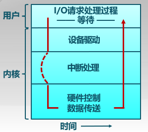

2.**非阻塞I/O**：”Don't Wait“

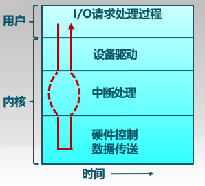

3.**异步I/O**：“Tell Me Later”

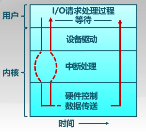

* 读数据时，使用**指针标记好用户缓冲区，立即返回**；稍后内核将填充缓冲区并通知用户

* 写数据时，使用指针标记好用户缓冲区，立即返回；稍后内核将处理数据并通知用户
* **驱动需要等待，应用程序可以干别的事**

## I/O结构

**北桥连高速设备，南桥连I/O设备**

### CPU与设备的连接

设备控制器

* CPU和I/O设备间的接口
* 向CPU提供特殊指令和寄存器

I/O地址

* CPU用来控制I/O硬件
* 内存地址或端口号
  * I/O指令
  * 内存映射I/O

CPU与设备的通信方式

* **轮询、设备中断和DMA（直接内存访问）**

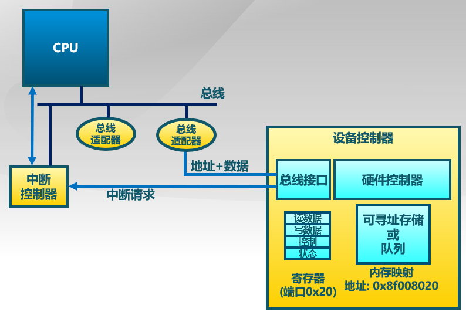

### I/O指令和内存映射I/O

#### I/O指令

* 通过I/O端口号访问设备寄存器
* 特殊的CPU指令

#### 内存映射I/O

* 设备的寄存器/存储被映射到内存物理地址空间中
* 通过内存load/store指令完成I/O操作
* MMU设置映射，硬件跳线或程序在启动时设置地址

### 内核I/O结构

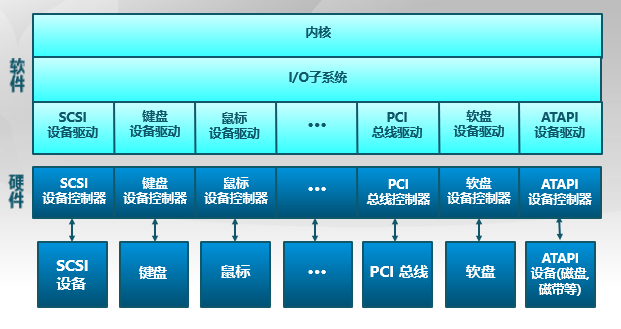

### I/O请求生存周期

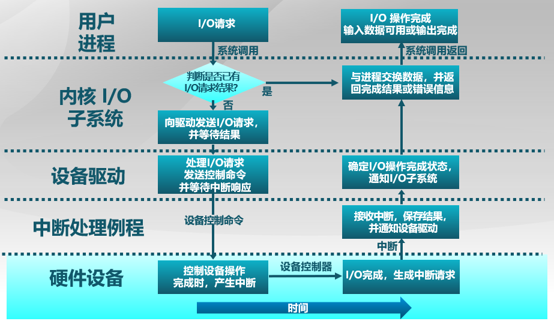

## I/O数据传输

### 程序控制I/O

通过CPU的in/out或者load/store传输所有数据

* 硬件简单，编程容易
* 消耗的CPU时间**和数据量成正比**
* 适用于简单的、小型的设备I/O

### 直接内存访问（DMA）

设备控制器可**直接访问系统总线**（此时CPU没有总线控制权），控制器**直接与内存**互相传输数据，CPU被解放

* 设备传输数据不影响CPU
* 需要CPU参与设置
* 适用于**高吞吐量I/O**

直接I/O寻址读取磁盘数据的步骤：

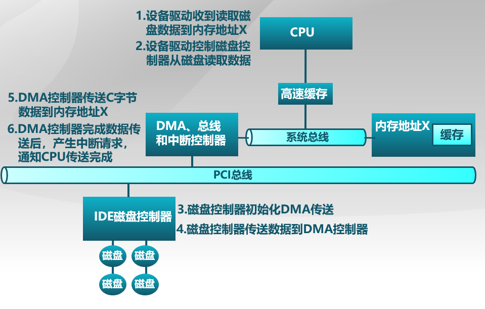

### I/O 设备通知操作系统的机制

操作系统需要了解I/O设备状态：是否完成？是否出错？

#### 1. CPU主动轮询

I/O 设备在特定的**状态寄存器**中放置状态和错误信息，操作系统**定期检测**状态寄存器

* 简单
* I/O操作频繁或**不可预测**时，开销大和延时长

#### 2. 设备中断

CPU布置好I/O操作后，就可以取忙别的了，此时I/O设备进行相应处理，**处理完成后，触发CPU中断**，CPU接收后执行相应中断处理例程

* 处理不可预测事件效果好
* 开销相对较高（因为CPU在每**两条指令执行期间**检查是否有中断）
* 一些设备可能结合了轮询和设备中断

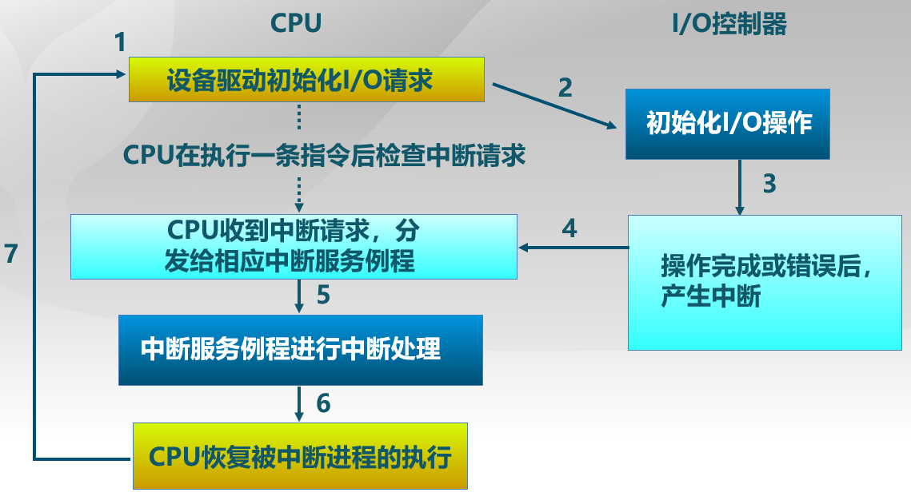

## 磁盘调度

### 磁盘工作机制和性能参数

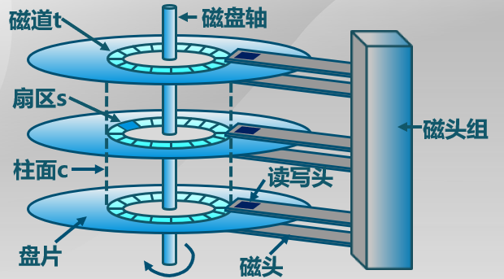

* 读取或写入时,磁头必须被定位在**期望的磁道**,并从所期望的**柱面或扇区**开始

* **寻道时间**: 定位到期望的磁道所花费的时间

* **旋转延迟**: 从扇区的开始处到到达目的处花费的时间

* **平均旋转延迟时间 = 磁盘旋转一周时间的一半**

### 磁盘调度算法

通过**优化磁盘访问请求顺序**来提高磁盘访问性能，原因有：

* **寻道时间**是**性能**上区别的原因，是磁盘访问最耗时的部分
* 同时会有多个在同一磁盘上的I/O请求

* 如果请求是随机的,那么会表现很差

#### 先进先出（FIFO）算法

* 按顺序处理请求

* 公平对待所有进程

* 在有很多进程的情况下,接近随机调度的性能
* 来回左右移动走了很多冤枉路，性能很差

#### 最短服务时间优先(SSTF）

* 选择从磁臂**当前位置需要移动最少**的I*/O请求

* 总是**选择最短寻道时间**

#### 扫描（SCAN）算法

* 磁臂在**一个方向上移动**,满足所有为完成的请求,直到磁臂到达该方向上最后的磁道，然后**调换方向**

* 也称为**电梯算法**

#### 循环扫描（C-SCAN）算法

* 限制了仅在一个方向上扫描（单向扫描）

* 当**最后一个磁道**也被访问过了后,磁臂返回到磁盘的另外一端再次进行扫描

#### c-loop算法(C-SCAN改进)

* 磁臂先到达该方向上**最后一个请求处**,然后**立即反转**，而不是先到最后点路径上的所有请求

#### N步扫描(N-step-SCAN)算法

**磁头粘着**(Arm Stickiness)现象：SSTF、SCAN及CSCAN等算法中，可能出现**磁头停留在某处不动**的情况，如进程反复请求对某一磁道的I/O操作，其他后续请求等待延时就会很长

具体N步扫描算法：

* 将磁盘请求队列分成长度为N的子队列
* 按**FIFO**算法依次处理所有**子队列**
* **扫描算法处理每个队列**

#### 双队列扫描（FSCAN）算法

N步扫描算法的简化

* 把磁盘I/O请求分成**两个队列**
* 交替使用扫描算法处理一个队列
* 新生成的磁盘I/O请求放入另一队列中，所有的新请求都将被推迟到**下一次扫描**时处理

## 磁盘缓存

磁盘缓存是磁盘扇区**在内存中的缓存区**

注：

* 虚拟内存是在磁盘中存储内存里存不下的数据
* 磁盘缓存则倒过来
* 磁盘缓存的调度算法一般会比虚拟存储更复杂

### 单缓存和双缓存

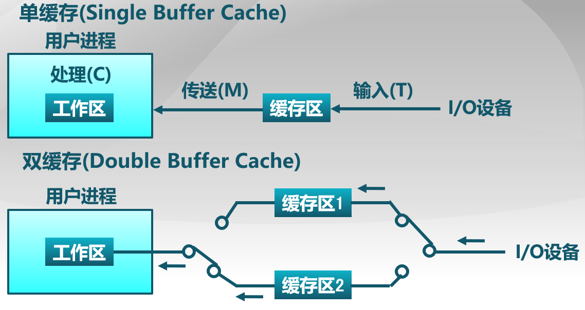

单缓存读写不能同时进行

### 访问频率置换算法(Frequency-based Replacement)

问题：在一段密集磁盘访问后，LFU（最不常用，访问次数）算法的引用计数变化无法反映当前的引用情况

算法思路：

* 考虑磁盘访问的密集特征，对**密集引用不计数**
* 在**短周期中使用LRU**（最近最久未使用，时间上）算法，而在**长周期中使用LFU**算法

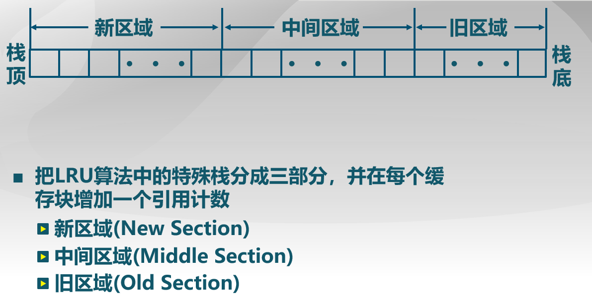

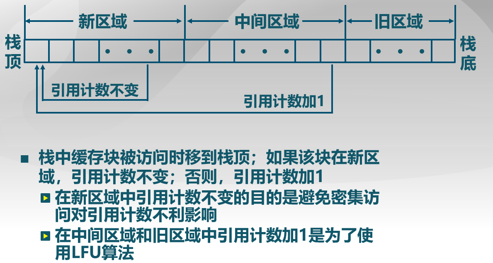

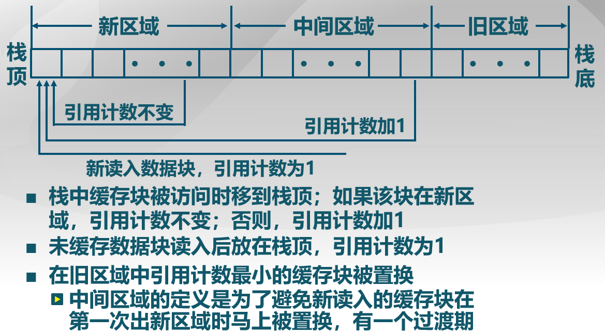

