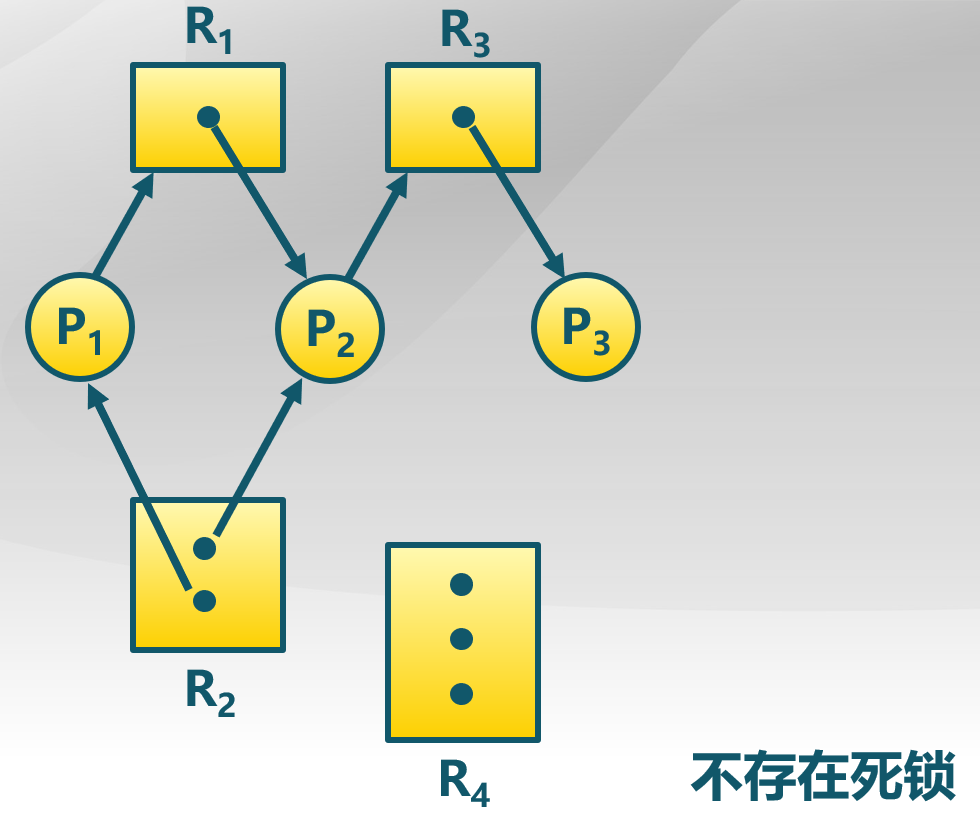
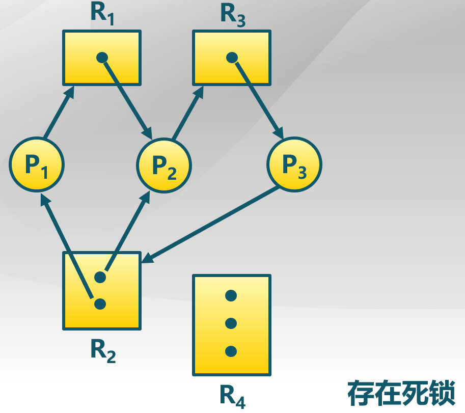
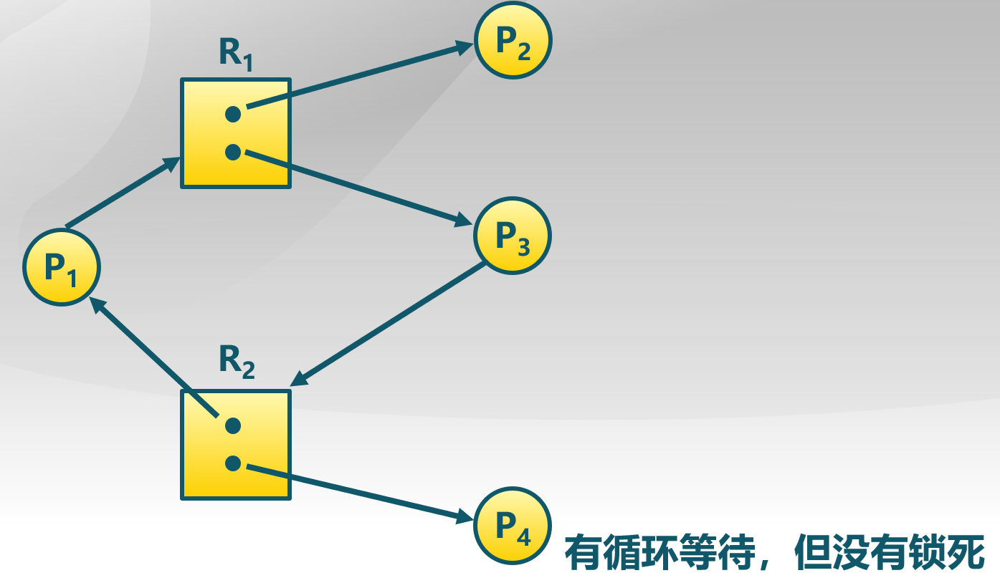
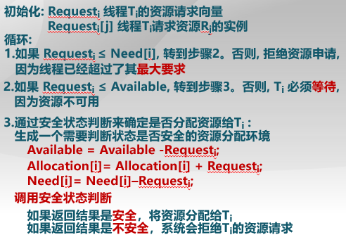
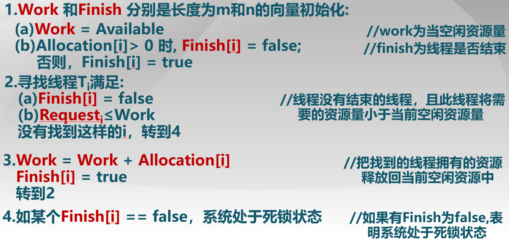
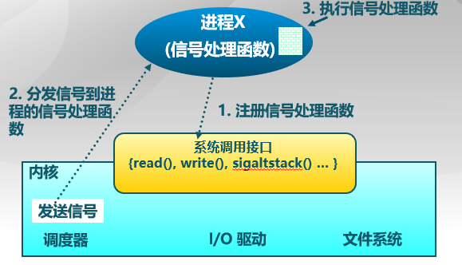
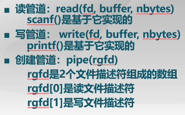
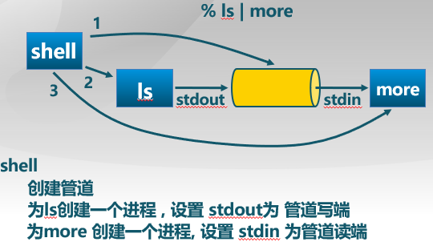
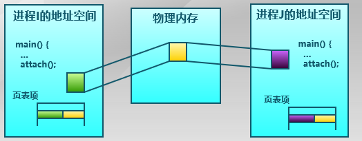

## 死锁问题

由于竞争资源或者通信关系，两个或更多线程在执行中出现，永远相互等待只能由其他进程引发的事件

## 系统模型

资源类型R1,R2,..,Rm

* CPU执行时间
* 内存空间
* IO 设备等

每个资源类型Ri有Wi个实例

每个进程使用资源流程：

- require,get ← free resource
- use,hold    ← requested,used resource
- release     ← free resource

### 资源分类

#### 可重复使用的资源

- 在一个时间只能有一个进程使用且不能被删除
- 进程获得资源,后来释放由其他进程重用
- 示例：处理器,IO通道,主和副存储器,设备和数据结构,如文件,数据库和信号量
- 如果每个进程拥有一个资源并请求其他资源,**死锁可能发生**

#### 消耗资源

- 创建和销毁
- 示例：在IO缓存区的中断,信号,消息,信息等
- **可能会发生死锁**：进程间相互等待对方消息

### 资源分配图

描述资源和进程间的**分配和占用关系**的有向图

- 两类顶点:
    - P={P1,P2,...,Pn},集合包括系统中的**所有进程**
    - R={R1,R2,...,Rm},集合包括系统中的**所有资源**
- 两类有向边：
    *  资源请求边：Pi → Rj 进程Pi请求资源Rj
    * 资源分配边：Rj → Pi 资源Rj已经分配给进程Pi

#### 基本情况

1.如果图中**不包含循环**:

- 没有死锁

2.如果图中**包含循环**:

- 如果每个资源类只有一个实例,那么死锁

- 如果每个资源类有几个实例,可能死锁

**附：当S状态的资源分配图是不可以完全简化的，则S为死锁状态（充分条件）**

## 死锁特征

### 死锁的四个必要条件:（重要！！！）

- **互斥**: 在一个时间只能有一个进程使用资源
- **持有并等待**: 进程保持至少一个资源正在等待获取其他进程持有的额外资源
- **非抢占**: 一个资源只能被进程资源释放,进程已经完成了它的任务之后
- **循环等待**: 存在等待进程集合{P0,P1,...,Pn},P0正在等待P1所占用的资源,P1正在等待P2占用的资源...Pn-1在等待Pn的资源,Pn正在等待P0所占用的资源

## 死锁处理方法

- 运行系统进入死锁状态,然后恢复.
- 忽略这个问题,假装系统中从来没有发生死锁,用于大多数操作系统,包括UNIX

### 1.死锁预防（Deadlock Prevention）

确保系统永远不会进入死锁状态，即**破坏四个死锁必要条件的任意一个**

破坏各个条件的方法：

- 互斥 - 把互斥的共享资源封装成可同时访问
- 持有并等待 - 保证当一个进程请求的资源,它不持有任何其他资源
    - 需要进程请求并分配其所有资源,它开始执行之前或允许进程请求资源仅当进程没有资源
    - 资源利用率低,可能发生饥饿
- 无抢占 -
    - 如果进程占有某些资源,并请求其他不能被立即分配的资源,则**释放当前正占有的资源**
    - 只在能够同时获得所有需要资源时，才执行分配操作
- 循环等待 - 对所有资源类型进行**排序**,并要求每个进程按照资源的顺序进行申请

### 2.死锁避免（Deadlock Avoidance）

在**使用前进行判断**，只允许不会出现死锁的进程请求资源

- 最简单和最有效的模式是要求每个进程**声明**它可能需要的每个类型资源的**最大数目**

    * 资源的分配状态是通过限定提供与分配的资源数量,和进程的最大需求

    * 死锁避免算法**动态检查**的资源分配状态,以确保永远不会有一个环形等待状态

- 当一个进程请求可用资源,系统必须判断立即分配是否能使系统处于安全状态

- 系统处于安全状态指: 针对所有进程,存在安全序列

- 序列<P1,P2,...,Pn>是安全的定义：针对每个Pi,Pi要求的资源≤前可用的资源+所有的Pj持有的资源,其中j<i.
    - 如果Pi资源的需求不是立即可用,那么Pi可以等到所有Pj完成
    - 当Pi完成后,Pi+1可以得到所需要的资源,执行,返回所分配的资源,并终止.
    - 用同样的方法,Pi+2,Pi+3和Pn能获得其所需的资源.

#### 安全状态与死锁的关系

- 如果系统处于安全状态→无死锁
- 如果系统处于不安全状态→可能死锁
- **避免死锁: 确保系统永远不会进入不安全状态**

#### 银行家算法

**避免死锁**产生的算法。以银行借贷分配策略为基础，判断并保证系统处于安全状态

### 3.死锁检测（Deadlock Detection）

在检测到运行系统进入死锁状态后，进行恢复

* 允许进入死锁
* 维护系统资源分配图
* 定期调用死锁检测算法来搜索图中是否存在死锁
* 出现死锁则进行死锁恢复

算法需要**O（m*n^2）操作**，m是资源类型数，n是进程数目

数据结构：

- Available: 长度为M的向量表示每种类型可用资源的数量
- Allocation: 一个nxm矩阵定义了当前分配给各个进程每种类型资源的数量,如果Alocation[i, j] = k, 进程Pi拥有资源Rj的k个实例
- Request: 一个nxm矩阵表示各进程的当前请求.如果Request[i, j] = k,表示进程Pi请求k个资源Pj的实例

与银行家算法有点类似

#### 检查算法使用

1.死锁检测的时间和周期选择依据

- 死锁多久可能会发生?
- 多少进程需要被回滚?

2.如果检测算法多次被调用,有可能是资源图有多个循环,所以我们无法分辨出多个可能死锁进程中的哪些"造成"死锁

### 4.死锁恢复（Recovery from Deadlock ）

终止所有的死锁进程

在一个时间内终止一个进程直到死锁消除

终止进程的顺序应该是:

- 进程的优先级
- 进程运行了多久以及需要多少时间才能完成
- 进程占用的资源
- 进程完成需要的资源
- 多少进程需要被终止
- 进程是交互还是批处理

#### 进程终止具体方法

1.资源抢占，以**最小的成本目标**选择被抢占进程 

2.进程回滚，返回到一些安全状态,重启进程到安全状态

**可能出现饥饿**，同一进程可能一直选作被抢占者

## 进程通信（IPC）

### 概述

进程通信是进程进行通信和同步的机制

IPC 提供2个基本操作:

- 发送操作send(message) - 消息大小固定或者可变
- 接收操作receive(message)

进程通信流程：

- 在它们之间建立**通信链路**
- 通过send/recevie**交换消息**

通信链路特征

- 物理(例如,共享内存,硬件总线)
- 逻辑(例如,逻辑属性)

### 直接通信

进程必须正确的命名对方:

- send(P, message) - 发送消息到进程P
- receive(Q, message) - 从进程Q接收信息

通信链路的属性

- 自动建立链路
- 一条链路恰好对应一对通信进程
- **每对进程之间只有一个链路存在**
- 链路可以是单向的，但**通常是双向的**

### 间接通信

通过操作系统维护的**消息队列**实现进程间的消息接收和发送

- 每个消息队列都有一个唯一的标识ID
- 只有**共享了相同消息队列**的进程才能够通信

通信链路的属性

- 只有进程共享一个共同的消息队列,才建立链路
- 连接可以是单向或者双向
- **消息队列可以与多个进程相关联**
- 每对进程可以共享多个通信链路

通信流程

- 创建一个新的消息队列
- 通过消息队列发送和接收消息
- 销毁消息队列

基本通信操作

- send(A, message)
- receive(A, message)

### 阻塞与非阻塞通信

* 阻塞通信
  * 阻塞发送：发送者在发送消息后进入等待，直到接收者成功收到
  * 阻塞接收：接收者在请求接收消息后进入等待，直到成功收到一个消息

* 非阻塞通信
  * 非阻塞发送：发送者在消息发送后，可立即进行其他操作
  * 非阻塞接收：没有消息发送时，接收者在请求接收消息后，接收不到任何消息

### 通信链路缓冲

3种缓冲方式:

1. 0容量: 发送方必须等待接收方
2. 有限容量：如果通信链路缓冲队列满时，发送方必须等待
3. 无限容量：发送方不需要等待

### 信号(Signal)

进程间的软件中断通知和处理机制，如SIGKILL, SIGSTOP,SIGCONT等

接收到信号时会发生什么?

- **捕获**（catch)：执行进程指定的信号处理函数被调用
- **忽略**（ignore）: 执行操作系统指定的缺省处理(abort, memory dump, suspend or resume process)
- **屏蔽**（mask）:   禁止进程接收和处理信号(可能是暂时的,当处理同样类型的信号)

不足:

- **传送信息量小**，不能传输要交换的任何数据

信号的实现：

### 管道

进程间**基于内存文件**的通信机制：在内存中建立临时文件

* 子进程从父进程继承文件描述符
* 缺省文件描述符：0 stdin, 1 stdout, 2 stderr

进程**不知道(或不关心)另一端**

* 可能从键盘,文件,程序读取
* 可能写入到终端、文件、程序

与管道相关的系统调用

举例：

$ ls | more (中间的丨就让shell建立管道，两个进程, 管道是缓存,对于ls来说是stdout,对于more来说是stdin )

### 消息队列

消息队列是由**操作系统维护**的以**字节序列为基本单位**的间接通信机制

- 每个消息（Message）是一个**字节序列**
- 相同标识的消息组成按**先进先出顺序**组成一个消息队列（Message Queues）

### 共享内存

共享内存是把**同一个物理内存区域同时映射到多个进程的内存地址空间**的通信机制

进程：

- 每个进程都有私有地址空间
- 在每个地址空间内,需明确地设置共享内存段

线程：

* 同一进程中的线程总是共享相同的内存地址空间

优点：

- 快速，方便地共享数据

不足：

- 必须用**额外的同步机制**来协调数据访问

#### 共享内存的实现

根据页表项将逻辑地址映射到相同的物理地址

特点：

* **最快的方法**

* 一个进程写另一个进程立即可见

* 没有系统调用干预

* 没有数据复制

* 不提供同步，由程序员提供同步，需要信号量等机制协调共享内存的访问冲突

## 进程间通信方式总结

信号、管道、消息队列、共享内存

其实还有：信号量、管程、套接字（Socket）