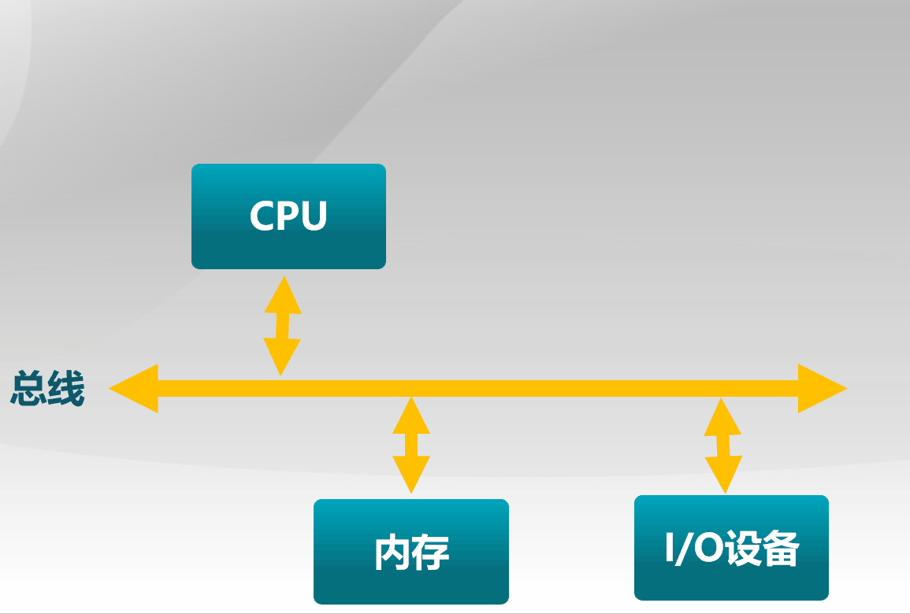
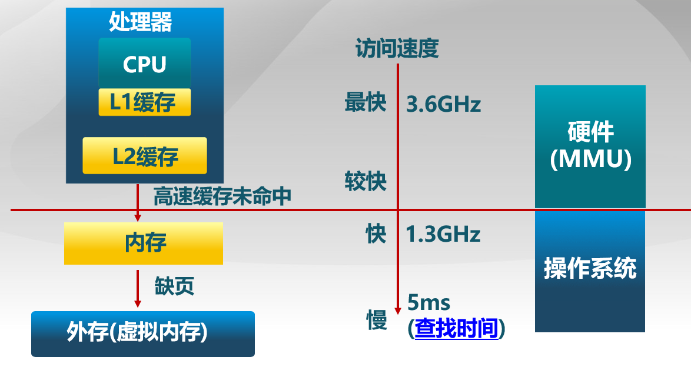
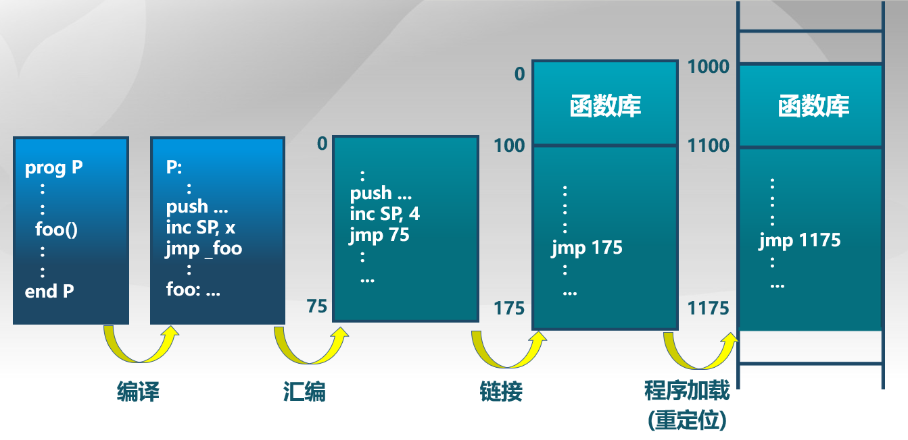
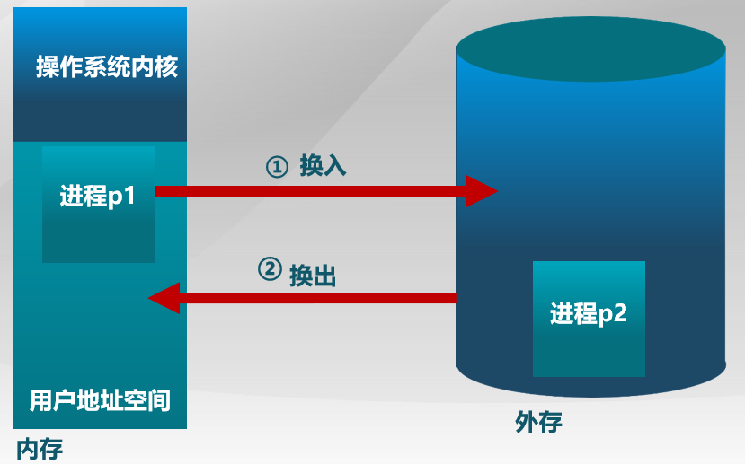

## 计算机体系结构

1.  CPU
2.  内存
3.  I/O设备

## 内存分层体系

运行内存(主存) / 磁盘等外存(虚拟内存). 

主存是在运行程序时所需要保存的数据空间，而磁盘是用于持久化数据保存的数据空间.

CPU可以访问的内存包括两大类 : 寄存器 / cache高速缓存(L1缓存 / L2缓存)

**内存最小访问单位：8bit即一字节**

### 内存管理目标

*   **抽象**：逻辑地址空间

*   **保护**：独立地址空间

*   **共享**：访问相同内存

*   **虚拟**：更多的地址空间

### 内存管理方法

*   程序重定位：要求连续
*   分段
*   分页
*   虚拟内存
*   按需页式的虚拟内存

>   实现高度依赖于硬件, 其中内存管理单元(MMU)负责处理CPU的内存访问请求

## 地址空间

地址空间的定义

*   物理地址空间 —— 硬件支持的地址空间
*   逻辑地址空间 —— 一个运行在程序所拥有的的内存范围，即运行的进程所能看到的地址
*   物理地址和逻辑空间的映射关系需要**操作系统管理**。

### 逻辑地址生成

编译、汇编、链接、载入（重定位）

### 物理地址生成

- CPU根据指令，**查找逻辑地址的物理地址在什么地方。**
- MMU将逻辑地址映射到物理地址。

具体的执行步骤：

1. CPU执行某条指令时，算术逻辑单元(arithmetic and logic unit, ALU)发出请求：需要**逻辑地址**里的内存内容；
2. CPU中MMU表**查找逻辑地址对应的物理地址**，如果没有去内存中找；
3. 找到后，CPU控制器给主存发出请求：**需要某个物理地址上的内容**。
4. 主存把内存的内容**通过总线传给CPU**。

操作系统在这里的作用：

- 操作系统在四步之前，要把**映射**建立好；
- 确保访问的地址空间是**合法、安全**的。

## 连续内存分配

### 内存碎片问题

内存碎片问题指的是空闲的内存无法被利用

*   外部碎片 : 分配**单元间**的未使用内存
*   内部碎片 : 分配**单元内**的未使用内存

### 分区的动态分配

动态分配是指当程序被加载执行时，分配一个进程指定大小可变的分区(块、内存块)，分区的地址是**连续**的

分区的动态分配方式有以下三种 :

1.  **最先匹配** : 分配n个字节，使用**第一个**可用的空间比n大的空闲块
2.  **最佳匹配**: 分配n字节分区时， 查找并使用不小于n的**最小**空闲分区
3.  **最差匹配** : 分配n字节，使用尺寸不小于n的**最大**空闲分区

>  

>  

>  

分配方式对比表格：

| 分配方式         | 第一匹配分配|                         最优适配分配                         |                         最差适配分配                         |
| ---------------- | :----------------------------------------------------------- | :----------------------------------------------------------- | :----------------------------------------------------------- |
| 分配方式实现需求 | 1. 按地址排序的空闲块列表   2. 分配需要寻找一个合适的分区 3. 重分配需要检查是否可以合并相邻空闲分区 | 1. 按尺寸排序的空闲块列表 2. 分配需要寻找一个合适的分区 3. 重分配需要检查是否可以合并相邻空闲分区 | 1. 按尺寸排序的空闲块列表 2. 分配最大的分区 3. 重分配需要检查是否可以合并相邻空闲分区 |
| 优势             | 简单 / 易于产生更大空闲块                                    |             比较简单 / 大部分分配是小尺寸时高效              |             分配很快 / 大部分分配是中尺寸时高效              |
| 劣势             | 产生外部碎片 / 不确定性                                      |       产生外部碎片 / 重分配慢 / 产生很多没用的微小碎片       | 产生外部碎片 / 重分配慢 / 易于破碎大的空闲块以致大分区无法被分配 |

## 碎片整理方法

碎片整理：即通过**调整进程占用的分区位置**来减少或避免分区碎片

1.  **紧凑（压缩式碎片整理）**
    
    *   移动分配给进程的内存分区，以合并外部碎片
    *   条件：所有程序是**动态重定位**的
    *   问题 : 
        *   什么时候移动? (在程序处于等待状态时才可以重定位)
        *   需要考虑内存拷贝的开销
    
2.  **分区对换（交换式碎片整理）**

    *   抢占并回收处于等待状态进程的分区，以增大可用内存空间
*   回收的分区可以放入到外存中

示意图：
    

    
*   问题 :（由于**内外存速度差异很大**等因素）
    
    *   哪些程序应该被回收 ?（要**仔细权衡**）

## 伙伴系统（连续分配内存实例）

### 数据结构

* 空闲块按大小和起始地址组织成二维数组的空闲块
* 初始状态：只有一个大小为2U的空闲块，2U即为整个可分配的分区大小

### 分配过程

1. 由小到大在空闲块数组中找最小的可用空闲块
2. 如空闲块过大，对可用空闲块进行二等分，直到得到合适的可用空闲块

