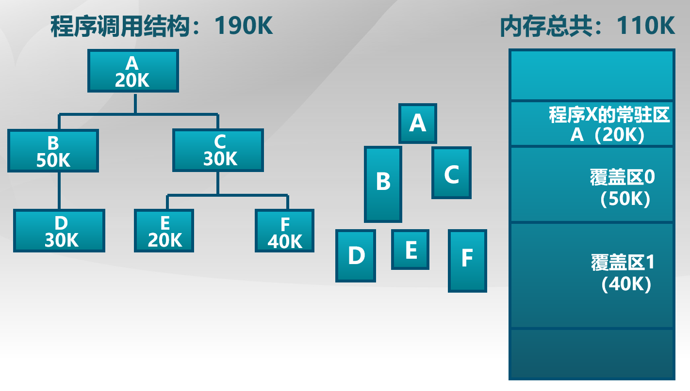
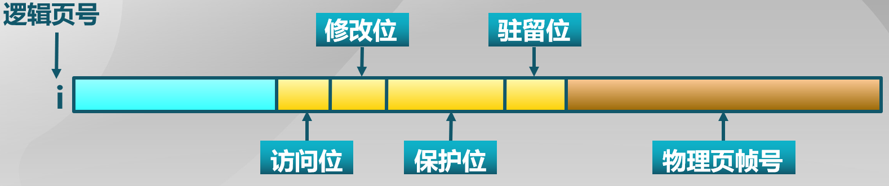

## 虚拟内存的需求背景

使用硬盘/磁盘使更多的程序在有限的内存中运行

理想的存储器 : 容量更大、速度更快、价格更便宜的非易失性存储器

计算机系统常出现**内存不足**问题的解决办法：

1. **覆盖**：应用程序**手动**把需要的指令和数据保存在内存中
2. **交换**：操作系统**自动**把暂时不能执行的程序保存到外存中
3. **虚拟存储**：在有限容量的内存中，**以页为单位**自动装入更多更大的程序

## 覆盖技术

如果是程序太大, 超出了内存的容量, 可以采用**覆盖(overlay)技术**, 只把需要的指令和数据保存在内存当中

**目的** : 

是在较小的可用内存中运行较大的程序, 常用于多道程序系统, 与分区存储管理配合使用.

**方法** :

把程序按照其自身逻辑结构, 划分为**若干个功能上相互独立**的程序模块,**不会同时执行的模块共享同一块内存区域**, 按时间先后来运行.

-   **必要部分(常用功能)**的代码和数据常驻内存;
-   **可选部分(不常用功能)**在其他程序模块中实现, 平时存放在外存中, 在需要**用到时才装入内存**;
-   **不存在调用关系**的模块可以相互覆盖

>   也就是说,程序松耦合的部分可以按需装入内存,不需要的时候放在外存中,多个不常用部分共用一个分区

实例 :



上述图示还有另一种调用方法（100K）：

——A占一个分区（20K）

——B、E、F占一个分区（50K）

——C、D占一个分区（30K）


**缺点** :

-   需程序员来把程序划分为若干个功能模块, 并确定各个模块间的覆盖关系, **增加了编程的复杂度**;
-   从外存装入覆盖模块, **增加执行时间**

## 交换技术

如果是程序太多, 超过了内存的容量, 可以采用**交换(swapping)技术**, 把暂时不能执行的程序送到外存中，之前内存管理也提到过

**目的** : 

增加正在运行或需要运行的程序的内存

**方法** :

* 可将暂时不能运行的程序送到外存,
* 换入换出的**基本单位**为**整个程序的地址空间**

**存在问题** :

-   以进程作为交换的单位, 需要把进程的整个地址空间都换入换出, **增加了处理器的开销**
-   **交换时机的确定** : 何时需要发生交换? 
    * 只当**内存空间不够**或**有不够的危险**时换出;
-   交换区的大小 : 必须足够大以存放**所有用户进程的所有内存映像的拷贝**
-   程序换入时的重定位 : 换出后再换入要放在原处吗？
    * 最好采用**动态地址映射**的方法

## 覆盖技术和交换技术的对比

覆盖 :

-   只能发生在没有调用关系的程序模块之间
-   程序员必须给出模块间的逻辑覆盖结构
-   发生在运行程序的内部模块之间

交换：

* 以进程为单位
* 不需要程序员给出模块间的逻辑覆盖结构
* 发生在内存中程序与管理程序或操作系统之间，即内存进程之间


## 虚拟内存管理技术

如果想要在有限容量的内存中, 以更小的页粒度为单位装入更多更大的程序, 可以采用自动的虚拟存储技术

-   目标

    * 只把部分程序放在内存中, 因而能够运行比物理内存空间大的程序。由操作系统自动来完成, 无需程序员的干涉。

    * 实现进程在内存与外存之间的交换, 从而获得更多的空闲内存空间。在内存和外存之间只交换进程的**部分内容**

- **程序局部性原理（记住！！！）**

  程序的局部性原理(principle of locality)是指程序在执行过程中的一个**较短时期**, 所执行的**指令地址和指令的操作数地址**, 分别**局限于一定的区域**.

  -   **时间局部性** : 一条指令的一次执行和下次执行, 一个数据的一次访问和下次访问都集中在一个较短时期内 。
  -   **空间局部性** : 当前指令和邻近的几条指令, 当前访问的数据和邻近的几个数据都集中在一个较小区域内。
  -   **分支局部性**：一条指令的两次执行，很可能跳到相同的内存位置

  程序的**局部性原理表明**, 从**理论上来说**, **虚拟存储技术是能够实现的**。而且在实现了以后能够取得一个满意的效果.

  实例 :
  页面大小为4k, 分配给每个进程的物理页面是1。在一个进程中, 定义了如下的二维数组：

   ```cpp
   int A[1024][1024]
   ```

   该数组按行存放在内存, **每一行放在一个页面中**。考虑一下程序的编写方法对缺页率的影响?

  ```cpp
  程序编写方法1 : (发生了1024*1024次缺页中断)
  //按列读取
  for(j = 0; j < 1024; j++)
  	for(i = 0; i < 1024; i++)
  		A[i][j] = 0;
  
  程序编写方法2 : (发生了1024次缺页中断)
  //按行读取
  for(i = 0; i < 1024; i++)
  	for(j = 0; j < 1024; j++)
  		A[i][j] = 0;
  ```

  ### 虚拟存储基本概念

  可以在**页式**或**段式**内存管理的基础上实现

  **思路**：将不常用的部分内存块暂存到外存

-  **原理**：

  * 装载程序时
    * 只需将**当前指令执行**的部分页面或段装入到内存中

  -   指令执行中需要的指令或数据尚不在内存中(称为**缺页或缺段**)时
      * 则由处理器通知**操作系统将相应的页面或段调入到内存**, 然后继续执行程序
  -   操作系统将内存中暂时不使用的页面或段保存在外存上

- **基本特征**

  -   **大的用户空间** : 通过把物理内存和外存相结合, 提供给用户的虚拟内存空间通常大于实际的物理内存
  -   **部分交换** : 虚拟存储的调入和调出是对部分虚拟地址空间进行的
  -   **不连续性** : 物理内存分配非连续, 虚拟地址空间使用非连续

  #### 虚拟页式存储

  页式存储管理，是把所有的页都加载到内存中

  页表 : 完成逻辑页到物理页帧的映射

  > 大部分虚拟存储系统都采用虚拟页式存储管理技术, 即在页式存储管理的基础上, **增加请求调页和页面置换功能**。

-   **基本思路**

      -   当用户程序要调入内存运行时, 不是将该程序的所有页面都装入内存, 而是只装入部分的页面, 就可启动程序运行.
      -   在运行的过程中, 如果发现要运行的程序或要访问的数据不在内存, 则向系统发出**缺页的中断请求**, 操作系统在处理这个中断时, 将外存中相应的页面调入内存, 使进程能够继续运行

- **页表表项**

  

    **驻留位** : 表示该页是否在内存

    **保护位** : 表示允许对该页做何种类型的访问, 如只读, 可读写, 可执行等

    **修改位** : 表示此页在内存中是否被修改过。当系统回收该物理页面时, 根据此位来决定是否把它的内容写回外存

    **访问位** : 表示该页是否被访问过（读或写）。用于**页面置换算法**

  

  ### 缺页中断处理流程 

  1.  如果在内存中有空闲的物理页面, 则分配一物理页帧f, 然后转第4步; 否则转到第2步
  2.  采用**页面置换算法**, 选择一个将被替换的物理页帧f, 它所对应的逻辑页为q, 如果该页在内存期间**被修改过, 则需要把它写回外存**
  3.  对q所对应的页表项修改, 把驻留位置为0
  4.  将需要访问的页p装入到物理页面f当中
  5.  修改p所对应的页表项的内容, 把驻留位置为1, 把物理页帧号置为f
  6.  重新执行产生缺页的指令

  #### 虚拟页式存储中的外存管理

  >   在何处保存未被映射的页?
  >
  >   -   应能够方便地找到在外存中的页面内容
  >   -   交换空间(磁盘或者文件) : 采用特殊格式存储未被映射的页面

  > 虚拟页式存储中的外存选择:
  >
  > -   代码段 : 映射到可执行二进制文件
  > -   动态加载的共享库程序段 : 映射到动态调用的库文件
  > -   其他段 : 映射到交换空间

  #### 虚拟内存性能

  **衡量指标**：有效存储器访问时间 effective memory access time (EAT)

  EAT = 访存时间 * 页表命中几率 + 缺页异常处理时间 * 缺页率

  **页表命中几率 + 缺页率 = 1**

  例子 :

  > 访存时间 : 10 ns
  >
  > 磁盘访问时间 : 5 ms
  >
  > 缺页率p
  >
  > 页修改概率q
  >
  > EAT = 10\*(1-p) + 5,000,000\*p\*(1+q)

