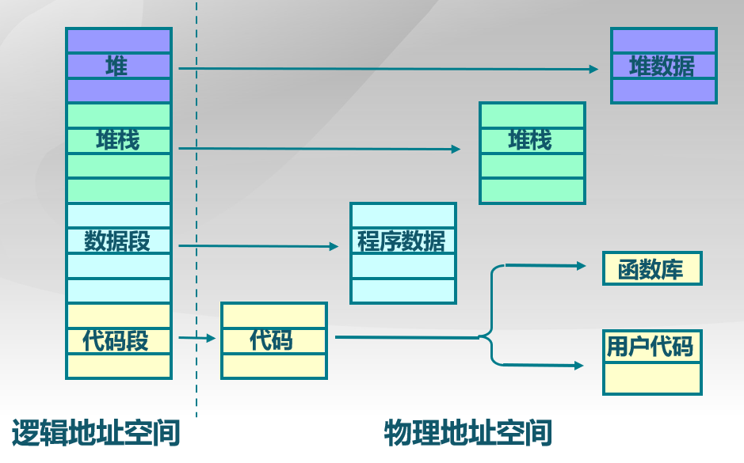
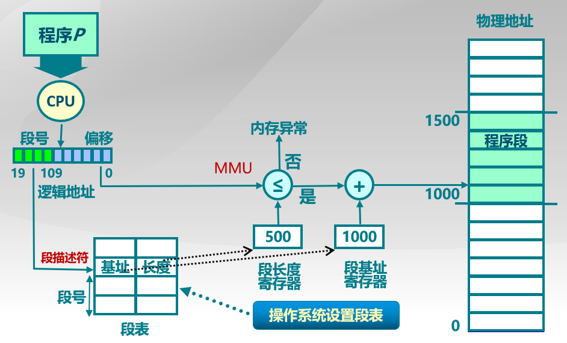
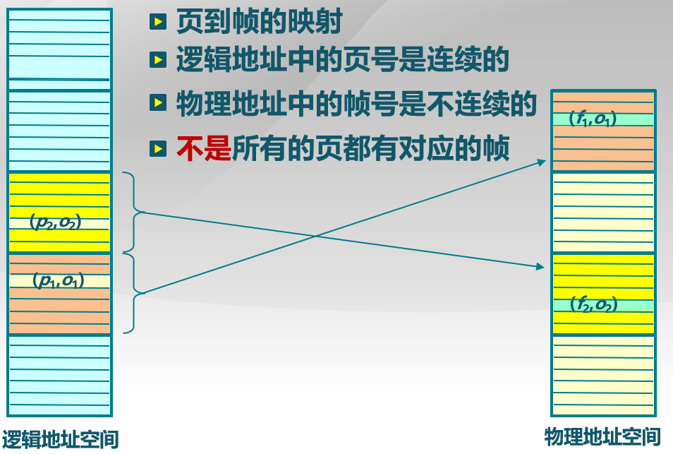
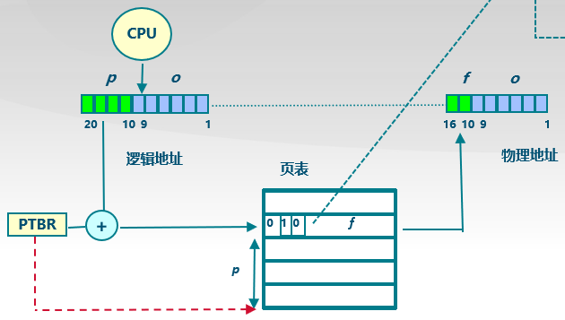
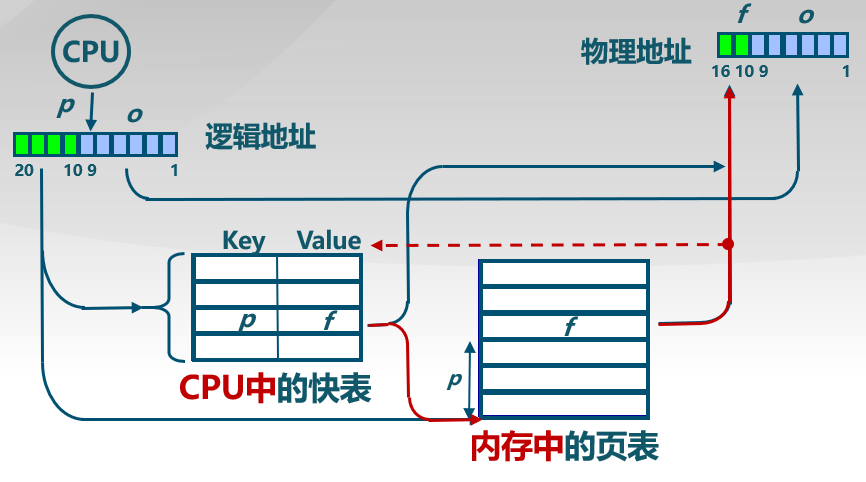
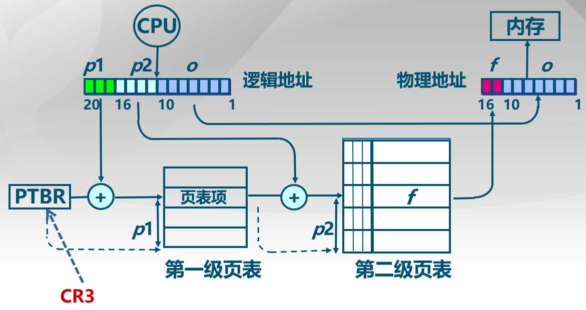
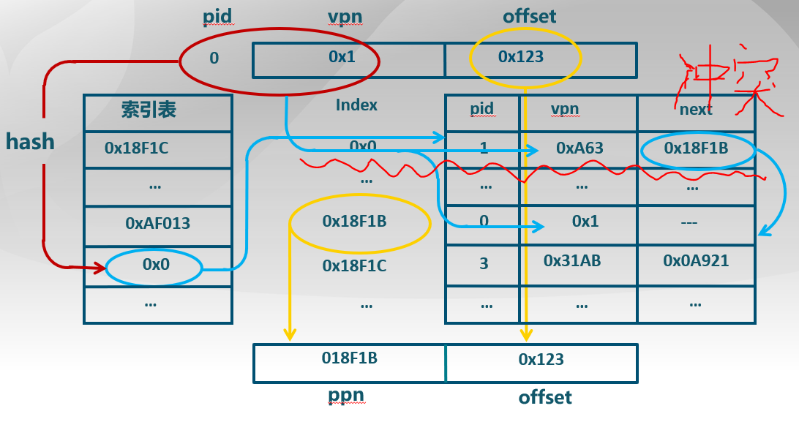
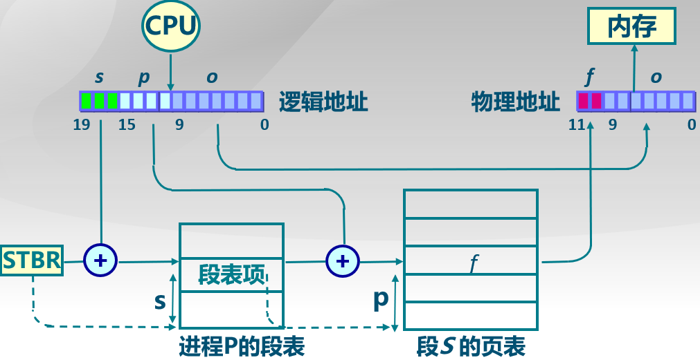
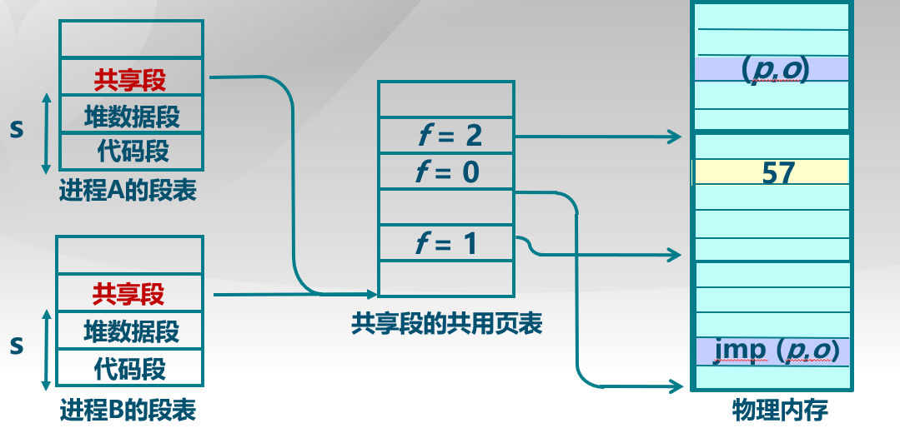

## 非连续内存分配的必要性

### 连续内存分配的缺点

1.  分配给一个程序的物理内存是连续的
2.  内存**利用率低**
3.  有外碎片 / 内碎片的问题
4.  内存分配的**动态修改困难**

故非连续分配的设计**目标**：**提高内存利用效率**和**管理灵活性**

### 非连续内存分配的优点

1.  一个程序的物理地址空间是非连续的

2.  更好的内存利用和管理

3.  允许共享代码与数据(共享库等...)

4.  支持**动态加载和动态链接**

### 非连续内存分配的缺点

1.  虚拟地址和物理地址的**转换难度大**

    *   软件方案（开销大）

    *   硬件方案(主要考虑的方案) : 分段 / 分页

## 非连续内存分配

### 段式存储管理(Segmentation)

**段 :** 进程的段地址空间由多个段组成

**分段意义: **更细的粒度和灵活的分离和共享

**分段寻址方案**

逻辑地址空间连续，但是物理地址空间不连续，使用映射机制进行关联，一个段就是一个内存"块"

程序访问内存地址需要 : 一个二维的二元组(s, addr) → (段号, 地址)

操作系统维护一张段表, 存储着：**(段号, 物理地址中的起始地址, 长度限制)**

**物理地址 : 段表中的基地址 + 偏移地址**

### 页式存储管理(Paging)

#### 分页地址空间

页帧(Page Frame)：把**物理地址空间**划分为大小相同的基本分配单位

-   大小是2的幂, 512 /1024/ 4096 / 8192等

页(Page)：把**逻辑地址空间**也划分为相同大小的基本分配单位（Linux下一般是**4KB**）

-   大小是2的幂, 512 /1024/ 4096 / 8192等

逻辑地址转换为物理地址(pages to frames)：

-   页表
-   MMU / TLB

**页帧(Frame)**

物理内存被分割为大小相等的帧. 一个内存物理地址是一个二元组(f, o) → (帧号, 帧内偏移)

帧号 : F位, 共有2^F个帧

帧内偏移 : S位, **每帧**有2^S个字节

物理地址 = 2^S * f + o

(例子 : 16-bit地址空间, 9-bit(512 byte) 大小的页帧 物理地址 = (3,6) 物理地址 = 2^9 * 3 + 6 = 1542)

>   分页和分段的最大区别 : 这里的 S 是一个固定的数, 而分段中的长度限制不定

**页(Page)**

一个程序的逻辑地址空间被划分为大小相等的页. 

* **页内偏移的大小 = 帧内偏移的大小，但一般页号大小≠帧号大小**

一个逻辑地址是一个二元组(p, o) → (页号, 页内偏移)

页号 : P位, 共有2^P个页

页内偏移 : S位, 每页有2^S个字节

虚拟地址  = 2^S * p + o

#### 页寻址方案

操作系统维护一张页表, **页表**保存了逻辑地址——物理地址之间的映射关系

存储 : (页号, 帧号)

-   逻辑地址空间应当不小于物理内存空间
-   页是连续的虚拟内存
-   帧是非连续的物理内存(有助于减少碎片的产生)
-   **不是所有的页都有对应的帧**

### 页表(Page Table)

* 每一个运行的程序都有一个页表
* 每一个页面对应于一个**页表项**

-   页表随进程运行状态会动态变化
-   页表基址寄存器（PTRB）

查询流程：

页表项标志：

-   **存在位**resident bit (0 : 对应的物理页帧在内存中不存在 ; 1 : 存在)
-   **修改位**dirty bit（0：对应页面内容未修改，1：修改了）
-   **引用位**clock / reference bit（0：对应页面在过去一段时间内没有对它的引用，1：有）
-   **只读位**read only OR read/write bit

**内存访问的性能问题**：

* 访问一个内存单元需要**2次**内存访问
  * 一次用于获取页表项
  * 一次用于访问数据

* 页表可能非常大
  * 64位机器如果每页1024字节, 那么一个页表的大小会是多少？(2^64 / 2^10 = 2^54 （页表项），一般一个页表项占4字节空间，那么整个64为虚拟地址空间的映射就需要2^54 * 4 = 2^56字节的空间，也就是**64PB**！！根本存放不下，不过实际上好像每页一般是4KB，但这样也有16PB！！，一般32位的机器每个页表都4MB了，而每个进程又有各自的虚拟空间)
  * 每一个运行的程序都需要有一个页表

* 如何处理？
  * **缓存(Caching)**
  * **间接(Indirection)访问**，也就是多级页表，只把需要的二级页表部分留存

#### 快表(Translation Look-aside Buffer，TLB)

原理：**缓存近期访问的页表项**

-   TLB使用关联内存实现, 具备快速访问性能
-   如果TLB命中, 物理页号可以很快被获取（就不用去内存的页表中找物理地址）
-   如果TLB未命中, 对应的表项被更新到TLB中(x86的CPU由硬件实现, 其他的可能是由操作系统实现)

#### 二级/多级页表

二级页表

-   将页号分为两个部分, 页表分为两个, **一级页号对应一级页表, 二级页号对应二级页表**.
-   一级页号查表获得在二级页表的起始地址, 地址加上二级页号的值（即偏移）, 在二级页表中获得物理地址的帧号

多级页表

-   通过把页号分为k个部分, 来实现多级间接页表, 建立一棵页表"树",减少每一级页表的长度
-   通过各级页表的**存在位**把对应不存在的页表省略掉，**大大节省空间**，用时间换空间

#### 反置页表

大地址空间系统，多级页表**很繁琐**，逻辑地址空间增长速度快于物理地址空间

反置页表只需要存在一张即可

页寄存器和反置页面的**思路**：

-   不让页表与逻辑地址空间的大小相对应, 
-   让页表与物理地址空间的大小相对应. 

##### 基于页寄存器(Page Registers)的实现方案

存储 **(帧号, 页号)** 使得表大小与物理内存大小相关, 而与逻辑内存关联减小.

**每一个帧和一个页寄存器关联**, 寄存器内容包括 :

-   使用位resident bit : 此帧是否被进程占用
-   占用页号occupier : 对应的页号 p
-   保护位protection bits

实例 :

-   物理内存大小是 : 4096 * 4096 = 4K * 4KB = 16 MB
-   页面大小是 : 4096 bytes = 4 KB
-   页帧数 : 4096 = 4 K
-   页寄存器使用的空间(假设每个页寄存器占用8 bytes) : 8 * 4096 = 32 Kbytes
-   页寄存器带来的额外开销 : 32K / 16M = 0.2%
-   虚拟内存大小 : 任意

优势 :

-   页表的大小相对于物理内存来说很小
-   页表的大小跟逻辑地址空间的大小无关

劣势 :

-   需要的信息对调, 要**根据帧号可以找到页号**
-   在需要在反向页表中搜索想要的页号

##### 页寄存器的地址转换

**CPU生成的逻辑地址如何找对应的物理地址？**

* 对逻辑地址进行Hash映射，以减少搜索范围
* 需要解决可能的冲突

通过哈希算法来搜索一个页对应的帧号，具体来说就是从**进程标识PID经过hash映射来获得帧号**

检查找到的页寄存器中的位置的PID、页号是否与原始的一致，若发生hash冲突就遍历冲突项链表

### 段页式存储管理

* **段式分的块比较大**，页式分了很小的标准大小的存储块
* 段式存储在内存保护方面有优势，页式存储在内存利用和优化转移到后备存储方面有优势
* 考虑段页式结合

#### 段页式：在段式存储管理基础上，给每个段加一级页表

段号、页号、页内偏移

另外，可以很容易地**通过指向相同的页表基址，实现进程间的段共享**

