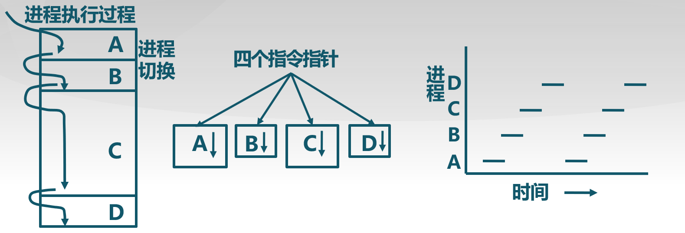
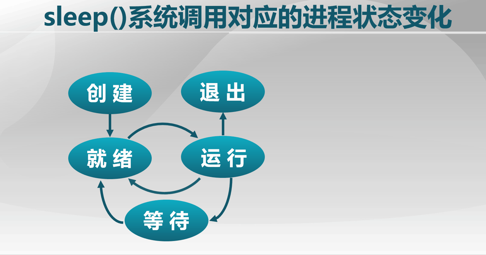
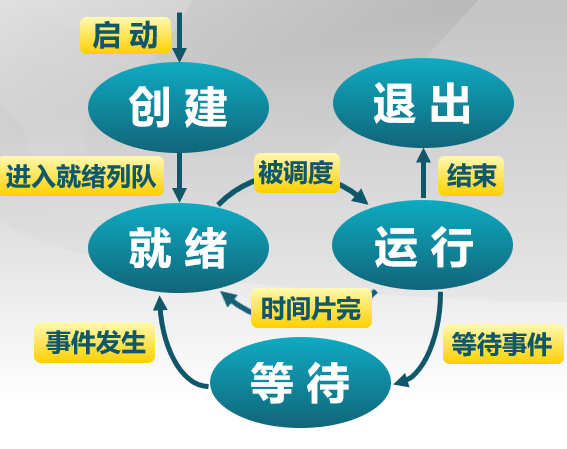
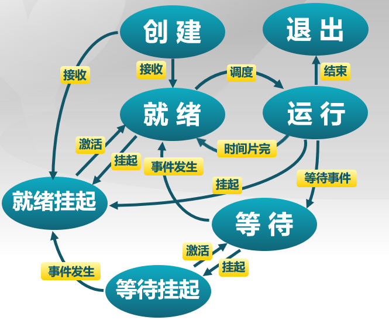
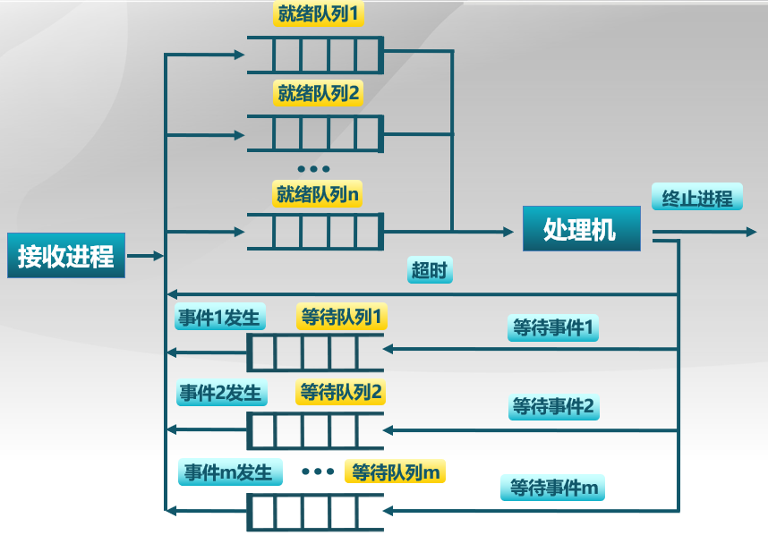
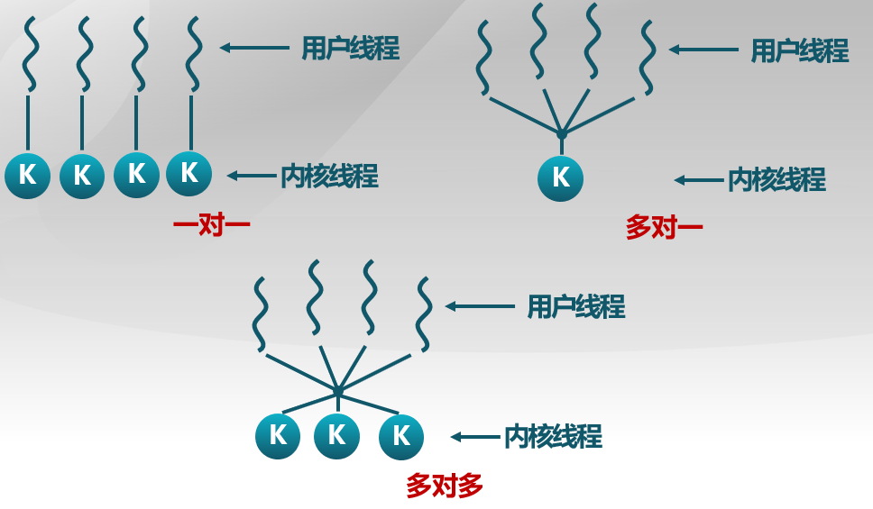

## 进程(process)描述

### 进程定义

进程 : 一个具有一定**独立功能**的程序在一个**数据集合**上的一次**动态执行**过程。

### 进程的组成

进程包含了正在运行的一个程序的**所有状态**信息

-   代码
-   处理的数据
-   状态寄存器，如CPU状态CR0、指令指针IP
-   通用寄存器AX、BX、CX
-   进程占用的系统资源，如打开的文件、已分配内存

进程和程序的联系 :

-   程序是产生进程的基础
-   程序的**每次运行构成不同的进程**，如命令“ls”的多次执行对应多个进程
-   进程是操作系统处于执行状态程序的**抽象**
-   一个程序多次执行过程可以对应为不同进程, 通过调用关系, **一个进程可包括多个程序**

进程和程序的区别 :

-   **进程是动态**的,  **程序是静态**的
    * 程序是有序代码的集合
    * 进程是程序的执行, 进程有核心态 / 用户态。
-   **进程是暂时的, 程序是永久的。** 进程是一个状态变化的过程, 程序可以长久保存。
-   进程和程序的组成不同 : 进程的组成**包括程序, 数据和进程控制块**(进程状态信息)

### 进程的特点

**动态性** : 可动态地创建、结束进程;

**并发性** : 进程可以被独立调度并占用处理机运行

**独立性** : 不同进程的工作不相互影响;(**页表是保障措施之一**)

**制约性** : 因访问共享数据/资源或进程间同步而产生制约。

>   因而抛出了一个问题 : 如果你要设计一个OS, 怎么样来实现其中的进程管理机制?



操作系统管理下，进程切换的代码作为一个独立的部分来看待

一个CPU里的物理指令指针转变为四个并发执行的进程，从而宏观上视为并发执行

### 进程控制结构

描述进程的数据结构 : **进程控制块** (Process Control Block，PCB)，是指操作系统管理控制进程运行所用的**信息集合**。操作系统为**每个进程都维护了一个PCB**。

* 注意：<font color='red'>**进程控制块是进程存在的唯一标志**</font>

进程的创建 : 为该进程生成一个PCB

**进程的终止 :** 回收它的PCB

**进程的组织管理 :** 通过对PCB的组织管理来实现

> PCB具体包含什么信息? 如何组织的? 进程的状态转换?

**PCB有以下三大类信息 :**

-   **<font color='orange'>进程标志信息</font>**。 如本进程的标志, 本进程的产生者标志(父进程标志)。
-   <font color='orange'>**处理机状态信息保存区** </font>: 保存进程的运行现场信息 
    -   用户可见寄存器。 用户程序可以使用的数据, 地址等寄存器
    -   控制和状态寄存器。 如程序计数器(PC), 程序状态字(PSW)
    -   栈指针。 过程调用, 系统调用, 中断处理和返回时需要用到它
-   <font color='orange'>**进程控制信息**</font>
    -   **调度和状态信息**。 用于操作系统调度进程并占用处理机使用。
    -   **进程间通信信息**。 为支持进程间与通信相关的各种标志, 信号, 信件等, 这些信息都存在接收方的进程控制块中。
    -   **存储管理信息**。 指向本进程映像存储空间的数据结构。
    -   **进程所用资源**。 进程使用的系统资源，如打开的文件等。
    -   **有关数据结构的链接信息**。 进程可以连接到一个进程队列中, 或连接到相关的其他进程的PCB。

**进程控制块的组织**

1.**链表** : 

* 同一状态的进程其PCB成一链表, 多个状态对应多个不同的链表。

* 各状态的进程形成不同的链表 : **就绪链表, 阻塞链表**

2.**索引表** : 

* 同一状态的进程归入一个索引表(由索引指向PCB), 多个状态对应多个不同的索引表
* 各状态的进行形成不同的索引表 : **就绪索引表, 阻塞索引表**

## 进程状态(state)

### 进程的生命周期划分

#### 1.进程创建

引起进程创建的3个主要事件 :

-   系统初始化
-   用户请求创建一个新进程
-   正在运行的进程执行了创建进程的系统调用

#### 2.进程运行

内核选择一个就绪的进程, 让它**占用处理机**并执行

#### 3.进程等待(阻塞)

在以下情况下, 进程等待(阻塞):

* 请求并等待系统服务, 无法马上完成

* 启动某种操作, 无法马上完成

* 需要的数据没有到达

进程<font color='red'>只能自己阻塞自己</font>, 因为**只有进程自身**才能知道何时需要等待某种事件的发生。

#### 4.进程抢占

* 高优先级进程就绪
* 进程执行当前时间用完（时间片轮转）
* 被抢占进程进入**就绪态**

#### 5.进程唤醒

唤醒进程的情况 :

* 被阻塞进程需要的资源可被满足

* 被阻塞进程等待的事件到达

* 将该进程的PCB插入到就绪队列

**进程只能被别的进程或操作系统唤醒**

#### 6.进程结束

进程结束的情况 :

-   正常退出(自愿)
-   错误退出(自愿)
-   致命错误(强制性)
-   被其他进程杀死(强制性)


简单实例：

main函数中只调用一个sleep（）休眠两秒时的进程状态转换情况



### 三状态进程模型

**进程的三种基本状态 :** 进程在生命结束前处于三种基本状态之一。

不同系统设置的进程状态数目不同。

**三种基本状态**

1.  <font color='red'>运行状态</font>(Running) : 当一个进程正在处理机上运行时
2.  <font color='red'>就绪状态(</font>Ready) : 一个进程获得了除处理机之外的一切所需资源, 一旦得到处理机即可运行
3.  <font color='red'>等待状态</font>(阻塞状态 Blocked) : 一个进程正在等待某一时间而暂停运行时。 如等待某资源, 等待输入/输出完成。

**进程其它的基本状态**

<font color='red'>创建状态</font>(New) : 一个进程正在被创建, 还没被转到就绪状态之前的状态

<font color='red'>结束状态</font>(Exit): 一个进程正在从系统中消失时的状态, 这是因为进程结束或由于其它原因所导致。**它的ID、PCB被回收**。

**可能的状态变化如下 :**

NULL → 创建 : 一个新进程被产生出来执行一个程序

创建 → 就绪: 当进程创建完成并初始化后, 一切就绪准备运行时, 变为就绪状态

就绪 → 运行  : 处于就绪态的进程**被进程调度程序选中**后, 就分配到处理机上来运行

运行 → 退出   : 当进程表示它已经**完成或者因出错**, 当前运行进程会由操作系统作结束处理

运行 → 就绪  : 处于运行状态的进程在其运行过程中, 由于分配它的处理机时间片用完而让出处理机（或被抢占）

运行 → 等待: 当进程请求某样东西且必须等待时

等待 → 就绪  : 当进程要等待某事件到来时, 它从阻塞状态变到就绪状态



### 进程挂起

进程在挂起状态时, 意味着进程没有占用内存空间, 处在**挂起状态的进程映像在磁盘上**，目的是<font color='red'>减少进程占用内存</font>



**两种挂起状态**

1.  <font color='orange'>等待挂起</font>状态 : 进程在外存并等待某事件的出现;
2.  <font color='orange'>就绪挂起</font>状态 : 进程在外存, 但只要进入内存, 即可运行。

**与挂起相关的状态转换**

**挂起 :** 把一个进程从内存转到外存, 可能有以下几种情况 :

-   **等待到等待**挂起 : 没有进程处于就绪状态或就绪进程要求更多内存资源时, 会进行这种转换, 以提交新进程或运行时就绪进程。
-   **就绪到就绪**挂起 : 当有高优先级等待(系统认为会很快就绪的)进程和低优先级就绪进程时, 系统会选择<font color='cornflowerblue'>挂起低优先级就绪进程</font>。
-   **运行到就绪**挂起 : 对抢先式分时系统, <font color='cornflowerblue'>当有高优先级等待挂起进程因事件出现而进入就绪挂起时</font>, 系统可能会把运行进程转导就绪挂起状态。

**在外存时的状态转换 :**

-   **等待挂起到就绪挂起** : 当有等待挂起因<font color='cornflowerblue'>相关事件出现</font>时, 系统会把等待挂起进程转换为就绪挂起进程。

**激活 :** 把一个进程从外存转到内存，可能有以下几种情况 :

-   **就绪挂起到就绪** : 没有就绪进程或挂起就绪进程优先级高于就绪进程时, 会进行这种转换。
-   **等待挂起到等待** : 当一个进程释放足够内存时, 系统会把一个高优先级阻塞挂起(系统认为会很快出现所等待的事件)进程转换为阻塞进程。

>   抛出一个问题 : OS怎么通过PCB和定义的进程状态来管理PCB, 帮助完成进程的调度过程?

### 状态队列

-   由操作系统来维护一组队列, 用来表示系统<font color='orange'>当中所有进程的当前状态</font>;
-   <font color='cornflowerblue'>不同的状态分别用不同的队列</font>来表示
    -   就绪队列, 各种等待队列
-   每个进程的<font color='cornflowerblue'>PCB都根据它的状态加入到相应的队列</font>当中
    -   当一个进程的状态发生变化时, 它的PCB从一个状态中脱离出来, 加入到另外一个队列。

#### 进程状态的队列表现：



## 线程(thread)

### 为什么使用线程?

实例 : 编写一个MP3播放软件。

核心功能 : 

(1)从MP3音频文件中读取数据

(2)对数据进行解压缩

(3)把解压缩后的音频数据播放出来

```cpp
//单进程方式
while(TRUE){
	Read();//频繁的I/O操作
	Decompress();
	Play();
}
Read(){...};
Decompress(){...};
Play(){...};
//问题: 1.播放出来的声音能否连贯? 2.各个函数之间不是并发执行, 影响资源的使用效率。
```

```cpp
//多进程实现
//进程1
while(TRUE){
	Read();
}
Read(){...};
//进程2
while(TRUE){
	Decompress();
}
Decompress(){...};
//进程3
while(TRUE){
	Play();
}
Play(){...};
//问题: 1.进程之间如何通信,共享数据? 2.维护进程的系统开销较大:创建进程、进程结束、进程切换
//创建进程时,分配资源,建立PCB;撤销进程时,回收资源,撤销PCB;进程切换时,保存当前进程的状态信息
```

因此需要提出一种新的实体, 满足以下特征:

1.  实体之间可以<font color='red'>并发</font>执行;
2.  实体之间<font color='red'>共享相同的地址空间</font>。

这实体就是线程。

### 线程的概念

线程是进程的一部分，描述**指令流执行状态**。它是进程中的**指令执行流的最小单元**，是**<font color='red'>CPU调度的基本单位</font>**。（区别：进程是资源调度的基本单位）

从两个方面重新理解进程:

1.  从**资源组合**的角度: 进程由一组相关资源构成,包括地址空间(代码段,数据段),打开的文件等各种资源;
2.  从**运行**的角度: 线程描述在进程资源环境中的指令流执行状态。

<font color='red'>线程 = 进程 - 共享资源</font>

### 线程的优缺点

线程的优点:

-   一个进程中可以同时存在多个线程;
-   各个线程之间可以并发地执行;
-   各个线程之间可以**共享**地址空间和文件等资源。

线程的缺点:

- 一个线程崩溃, 会导致其所属进程的所有线程崩溃。

线程所需的资源：

  不同的线程需要**独立**的寄存器和堆栈, 共享代码,数据和文件等。

### 线程和进程的比较

-   进程是<font color='orange'>资源分配</font>单位, 线程<font color='orange'>是CPU调度</font>单位;
-   进程拥有一个完整的资源平台, 而线程<font color='cornflowerblue'>只独享必不可少的资源</font>, 如寄存器和栈;
-   线程<font color='orange'>同样具有就绪,阻塞和执行三种基本状态</font>,同样具有状态之间的转换关系;
-   线程能<font color='red'>减少并发执行的时间和空间开销</font>:
    -   线程的创建时间比进程短(因为直接利用所属进程的一些状态信息)
    -   线程的终止时间比进程短(不需要考虑把这些状态信息给释放)
    -   同一进程内的线程切换时间比进程短(同一进程不同线程的切换不需要切换页表)
    -   由于同一进程的各线程之间共享内存和文件资源, 可直接进行不通过内核的通信。(直接通过内存地址读写资源)

### 线程的实现

主要有三种线程的实现方式:

-   **用户线程**  : 在用户空间实现; POSIX Pthreads, Mach C-threads, Solaris threads
-   **内核线程**  : 在内核中实现; Windows, Solaris, Linux
-   **轻量级进程**: 在内核中实现,支持用户线程; Solaris

#### **用户线程**

在用户空间实现的线程机制, 它<font color='cornflowerblue'>不依赖于操作系统的内核</font>, 由一组<font color='cornflowerblue'>用户级的线程库</font>来完成线程的管理, 包括进程的创建,终止,同步和调度等。

<font color='red'>操作系统只能看到进程, 看不到线程,</font> 线程的线程控制块（TCB）在线程库中实现;

-   操作系统内核不了解用户线程的存在,可用于不支持线程技术的<font color='purple'>多进程操作系统</font>;
-   每个进程都需要它**自己私有的线程控制块(TCB)**列表,用来跟踪记录它的各个线程的状态信息(PC,栈指针,寄存器),TCB由**线程库函数**来维护;
-   用户线程的切换也是由线程库函数来完成,无需用户态/核心态切换,所以**速度特别快**;
-   允许每个进程拥有**自定义的线程调度**算法。

用户线程的缺点:

-   如果一个线程发起<font color='cornflowerblue'>系统调用</font>而阻塞,则**整个进程在等待**
-   **不支持基于线程的处理机抢占**，当一个线程开始运行时,除非它主动地交出CPU的使用权,否则它所在的进程当中的其他线程将无法抢占CPU
-   由于**时间片分配给进程**,所以与其他进程比,**在多线程执行时,每个线程得到的时间片较少**,执行会较慢。

#### **内核线程**

内核线程是由**内核通过系统调用**实现的一种线程机制,由操作系统的内核来完成线程的创建,终止和管理。

操作系统能够看到进程也可能看到线程,线程在内核中实现

-   在支持内核线程的操作系统中,由**内核来维护进程和线程的上下文信息(PCB和TCB)**
-   在一个进程当中,如果某个内核线程发起系统调用而被阻塞,并**不会影响其他内核线程**的运行
-   线程的创建,终止和切换**系统开销相对较大**
    -   都是通过系统调用/内核函数的方式来进行,由内核来完成
-   以**线程为单位进行CPU时间分配**，多线程的进程获得更多CPU时间

#### **轻量级进程**

内核支持的用户线程。一个进程可以有一个或多个轻量级进程,每个轻量级进程由**一个单独的内核线程**来支持。(Solaris,Linux)

[注：线程实现方法有内核线程实现（1:1），用户线程实现（1：N），混合实现（M：N）]

#### 用户线程与内核线程的对应关系



目前看来，**一对一**的做法是比较好的（即线程采用内核线程实现方法）
