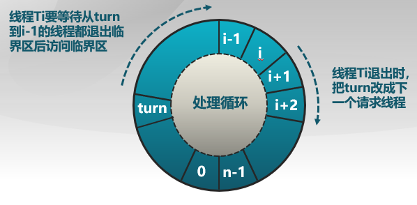

## 背景

对于独立的线程:

-   不和其他线程共享资源或状态
-   确定性: 输入状态决定结果
-   可重现: 能够重现起始条件
-   调度顺序不重要

并发进程:

-   在多个进程间资源共享
-   不确定性
-   不可重现

#### 并发进程的正确性

* 执行过程不确定、不可重现
* 程序错误可能间歇性发生

#### 进程并发执行好处

1.  **共享资源**
    -   多个用户一台电脑
    -   一个银行存款余额,多台ATM机
    -   嵌入式系统
2.  **加速**
    -   I/O操作和CPU计算可以重叠
    -   程序划分多模块在多处理器**并行执行**
3.  **模块化**
    -   将大程序分解成小程序 gcc会调用cpp,cc1,cc2,as,ld
    -   使系统易于扩展和复用

## 并发创建新进程时的标识分配

程序可以调用函数**fork()来创建一个新的进程**

- 操作系统需要分配一个新的并且唯一的进程ID

- 因此在内核中,这个系统调用会运行 

  ```cpp
  new_pid = next_pid++;
  ```

- 翻译成机器指令:

  ```汇编
  Load next_pid Reg1
  STORE Reg1 new_pid
  INC Reg1
  STORE Reg1 next_pid
  ```

假设两个进程并发执行：

- 如果next_pid等于100, 那么其中一个进程得到的ID应该是100, 另一个进程的ID应该是101, next_pid应该增加到102

#### 分配标识可能错误

可能在INC前进行了上下文切换, 最终导致两个进程的pid都是100,而next_pid也是101，这样的现象称为Race Condition**(竞态条件)**

## 原子操作（Atomic Operator）

原子操作是指一次不存在任何终端或者失败的执行

-   该执行成功结束
-   或者根本没有执行
-   并且不应发生任何部分执行的状态

也就是说，原子操作的所有命令，要么全部执行，要么都不执行

## 进程的交互关系：相互感知程度


交互过程中，进程间有可能出现下面三种情况：

**互斥**(Mutual exclusion)：是指当一个进程处于临界区并访问共享资源时,没有其他进程会处于临界区并且访问任何相同的共享资源

**死锁**(Dead lock)：是指两个或以上进程各占用部分资源,在相互等待对方释放相应资源,最终没法将自身任务进行下去

**饥饿**(Starvation)：其他进程由于优先级和调度算法等原因可能轮流占用资源，使得某个进程一直得不到资源

## 临界区

* **临界区**：进程中访问临界资源的一段需要互斥执行的**代码**，另外，临界资源是**一次仅允许一个**进程使用的共享资源
* **进入区**：检查可否进入临界区的代码，若可以进如，设置标志位
* **退出区**：清除标志位
* **剩余区**：代码其余部分

### 临界区访问规则

* 空闲则入
* 忙则等待

* 有限等待

* 让权等待(可选): **不能进入临界区的资源，应该释放CPU占用**（如转换到等待状态）

### 临界区的实现方法

各种方法的比较办法：**考虑性能，即并发级别**

#### 方法1:禁用硬件中断

此时其他进程就没有办法对当前进程的执行进行打扰了，但会对系统中断造成影响

因为没有中断,没有上下文切换,**故没有并发**

-   硬件将中断处理延迟到中断被启用之后（即进程离开临界区）
-   大多数现代计算机体系结构都提供**指令**来完成

进入临界区

-   禁用中断，保存标志

离开临界区

-   开启中断，恢复标志

##### 缺点

1.<font color='orange'>一旦中断被禁用,进程无法被停止</font>

-   整个系统都会为此停下来
-   可能导致其他线程处于饥饿状态

2.<font color='orange'>临界区可能很长</font>

-   无法限制响应中断所需的时间(可能存在硬件影响)

因而要小心使用,适合于较小的操作

#### 方法2:基于软件的同步解决方案

两个进程间，通过**共享变量的访问**，来实现线程间的同步

Peterson算法：满足线程Ti和Tj之间互斥的经典的基于软件的解决方法

```cpp
//共享变量
int turn;//表示该谁进入临界区
boolean flag[];//表示进程是否想要进入临界区 

//进入区代码
flag[i] = true;//想要进入
turn = j;
while (flag[j] && turn ==j)
    
//退出区代码
flag[i] = false;
```

```cpp
do {
      flag[i] = true;
      turn = j;
      while ( flag[j] && turn == j);

            CRITICAL SECTION

      flag[i] = false;

            REMAINDER SECTION

   } while (true);

```

Dekker算法: 第一个针对双线程例子的正确解决方案(与Peterson算法都是解决两个线程问题)

```cpp
flag[0]:= false; 
flag[1]:= false; 
turn:= 0;//or1 
	
do {
       flag[i] = true;
       while flag[j] == true { 
            if turn ≠ i { 
               flag[i] := false 
               while turn ≠ i { } 
               flag[i] := true 
            }  
        } 
        CRITICAL SECTION
       turn := j
       flag[i] = false;
        EMAINDER SECTION
   } while (true);
```

扩展到多个线程：Eisenberg和McGuire



##### 缺点

* 复杂: 需要两个进程的共享数据项

* 需要忙等待: 浪费CPU时间

* 没有硬件保证的情况下无真正的软件解决方案: Perterson算法需要原子的LOAD和STORE指令

#### 方法3:更高级的抽象方法

硬件提供了一些原语

-   **中断禁用, 原子操作指令**等

操作系统提供更高级的编程抽象来简化并行编程

-   例如,锁,信号量
-   从硬件原语中构建

**锁**是一个抽象的数据结构

-   一个**二进制状态(锁定/解锁)**
-   Lock::Acquire() ：锁被释放前一直等待,然后得到锁
-   Lock::Release() ：锁释放,唤醒任何等待的进程

使用锁来编写临界区

-   前面的例子变得简单起来:

    ```cpp
    lock_next_pid->Acquire();
    new_pid = next_pid++;
    lock_next_pid->Release();
    ```

大多数现代体系结构都提供特殊的**原子操作指令**

-   通过特殊的内存访问电路
-   针对单处理器和多处理器

1.**测试和置位**（Test-and-Set ，TS）指令

-   从内存中读取值
-   测试该值是否为1(然后返回真或假)
-   内存值设置为1（不管原来的值是否为1）

```cpp
bool TestandSet(bool *target){
		bool rv = *target;
		*target = true;
		return rv;
}
```

2.**交换**指令

-   交换内存中的两个值

```cpp
void Exchange(bool *a, bool *b){
		bool tmp = *a;
		*a = *b;
		*b = tmp;
}
```

##### 使用TS指令实现自旋锁(spinlock)

注：交换指令也可以实现

```cpp
class Lock {
    int value = 0;
}

Lock::Acquire() {
   while (test-and-set(value))
      ; //spin
}

Lock::Release() {
    value = 0;
}
//这种方法线程在等待的时候消耗CPU时间
```

##### 无忙等待锁

```cpp
//无忙等待
class Lock {
   int value = 0;
   WaitQueue q;
}


Lock::Acquire() {
   while (test-and-set(value)) {
      add this TCB to wait queue q;
      schedule();
   }
}

Lock::Release() {
   value = 0;
   remove one thread t from q;
   wakeup(t);
}
```

##### 原子操作指令锁的特征

优点：

1. 适用于单处理器或者共享主存的多处理器中**任意数量**的进程同步
2. 简单
3. 支持多临界区

缺点：

1. 忙等待消耗CPU时间
2. 可能导致饥饿（由于**线程队列顺序不一定是申请锁的顺序**）
3. **死锁**（**低优先级占用临界资源，高优先级占用CPU**，使得互相等待对方释放资源）

## 同步方法总结

锁是更高等级的编程抽象

-   互斥可以使用锁来实现
-   通常需要一定等级的硬件支持

常用的三种实现方法

-   禁用中断(**仅限于单处理器**)
-   软件方法(**复杂**)
-   原子操作指令(**单处理器或多处理器均可**)

