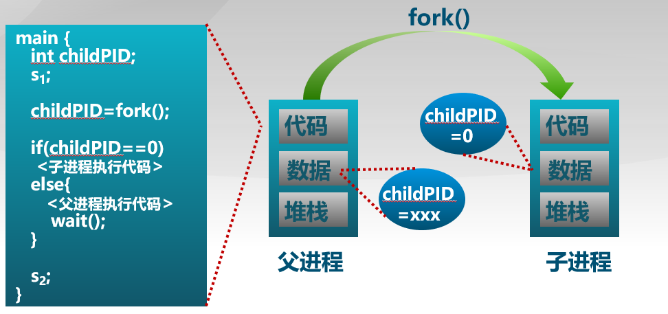
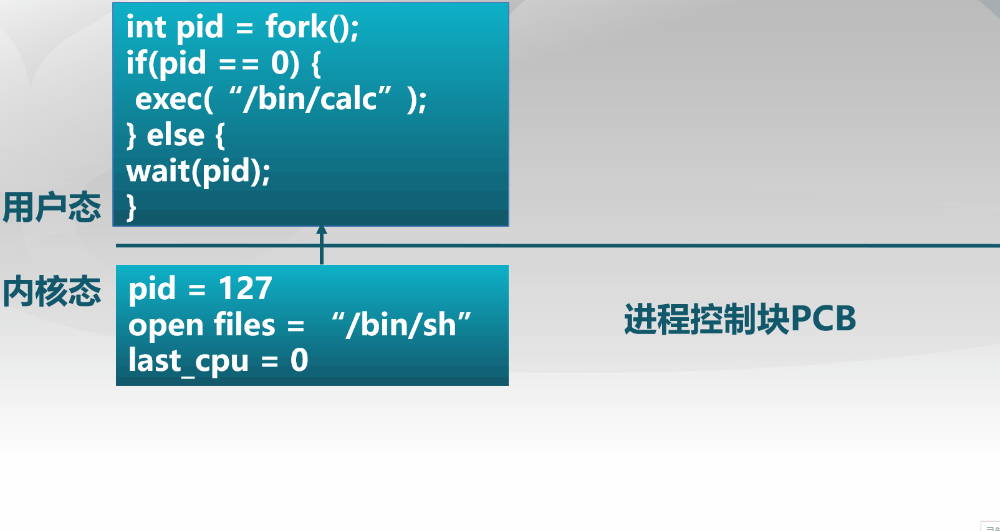
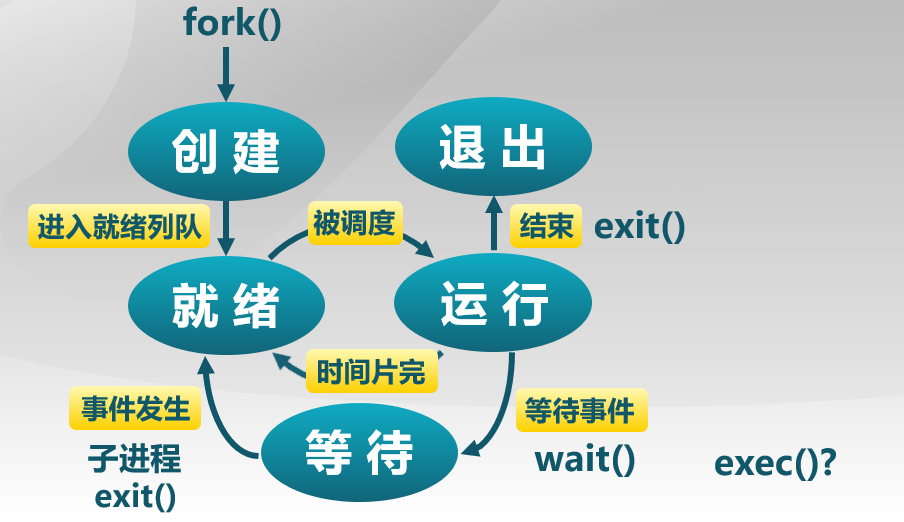

## 进程切换（上下文切换）

暂停当前运行进程，从运行状态变成其他状态，并且调度另一个进程从就绪状态转变为运行状态

进程切换的要求：

-   切换前，保存进程上下文
-   切换后，恢复进程上下文
-   必须**快速**(上下文切换时非常频繁，所以通常情况下由汇编实现)

需要存储什么上下文?——**进程生命周期的信息**

- 寄存器(PC,SP...)

- CPU状态等信息

- 内存地址空间（由于不同进程各有各的区域，其实大部分不用保存）

上下文切换示意图：

  

### 进程控制块PCB：内核的进程状态记录

内核为每个进程维护了对应的进程控制块

内核将相同状态的进程控制块放置在同一队列中

-   **就绪队列**
-   **I/O等待队列**
    -   每个设备一个队列
-   **僵尸队列**：运行完毕还未被回收的进程

## 进程控制

### 创建进程

fork()创建一个**继承**的子进程

-   复制父进程的所有CPU寄存器(有一个寄存器例外)
-   复制父进程的所有内存和变量

fork()的返回值：

* **子进程的fork()返回0**
* **父进程的fork()返回子进程标识符**（即child PID）
* fork()返回值可方便后续使用，子进程可使用getpid()获取进程PID

#### fork()的地址空间复制

fork()执行过程对于子进程而言，是在调用时间对**父进程地址空间**的一次**复制**（完全的复制，但是有返回值的区别）

* 对于父进程fork()返回child PID，对于子进程返回值为0

在99%的情况下,我们在调用fork()之后调用exec()，从而**加载新程序取代当前运行进程**

fork()把一个进程复制成两个进程（PID改变），exec()用新程序来**重写**当前进程（但重写时**进程的pid**并**没有改变**)

在shell中调用fork()后加载计算器的示例：

#### fork()的开销

##### fork()的实现开销

* 对子进程分配内存
* 复制父进程的内存和CPU寄存器到子进程里
* **开销昂贵**！！

##### 1.在99%的情况里，我们在**调用fork()之后调用exec()**

-   在fork()操作中内存复制是没有作用的（**exec会重写**）
-   子进程将可能关闭打开的文件和连接
-   开销因此是最高的
-   为什么不能结合它们在一个调用中(OS/2, windows)?

##### 2.vfork()

-   创建进程时,不再创建一个同样的内存映像
-   一些时候称为**轻量级fork()**
-   子进程应该几乎立即调用exec()
-   现在使用copy on write(COW)技术，**写时复制**，即后面**需要用的时候**才延迟过来进行复制，如果里面直接进行覆盖，那就不执行复制

### 进程加载

exec()调用允许进程"加载"一个不同的程序并且在main开始执行(即 _start)

允许进程指定启动参数(argc，argv)

exec()调用成功时：

* 是**相同的进程**
* 但是运行了**不同的程序**

代码段，堆栈和堆等完全重写

### 进程的等待和退出

##### wait()系统调用用于**父进程等待子进程的结束**

-   子进程结束时通过exit()向父进程返回一个值
-   父进程通过wait()接受并处理返回值

**wait()系统调用的功能**：

-   有子进程存活时，父进程进入等待状态，等待子进程的返回结果
    -   当某子进程调用exit()时，唤醒父进程，将exit()返回值作为父进程中wait的返回值
-   有**僵尸子进程等待**时，wait()**立即**返回其中一个值
-   无子进程存活时，wait()**立刻返回**

##### 进程的有序终止exit()

-   进程结束执行时调用exit()，完成资源回收

**exit()系统调用的功能**：

-   将调用参数作为进程的“结果”
-   关闭所有打开的文件等占用资源
-   释放内存
-   释放大部分进程相关的内核数据结构
-   检查是否父进程是存活着的:
    -   如果存活,保留结果的值直到父进程需要它，并进入僵尸（zombie/defunct）状态
    -   如果没有，释放所有的数据结构，进程结束
-   清理所有等待的僵尸进程

-   进程终止是**最终的垃圾收集**(资源回收)

### 其他进程控制的系统调用

#### 优先级控制

* nice()指定进程的初始优先级
* Unix系统中进程优先级会**随执行时间而衰减**

#### 进程调试支持

* ptrace()允许一个进程控制另一个进程的执行
* 设置断点和查看寄存器等

#### 定时

* sleep()可以让进程在定时器的等待队列中等待指定

## 进程控制VS进程状态

exec()是**执行过程**中的一种状态