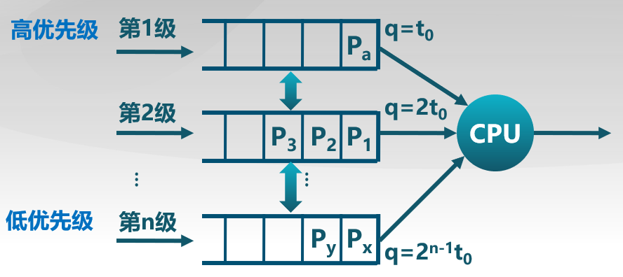

## 基本概念

### 上下文切换

-   CPU资源的当前占用者切换
-   保存当前进程/线程在PCB/TCB中的执行上下文(CPU状态)
-   恢复下一个进程/线程的上下文

### 处理机调度

-   从就绪队列中挑选一个进程/线程作为CPU将要运行的下一个进程/线程
-   从多个可用CPU中挑选**就绪进程**可使用的CPU资源

### 调度程序

挑选就绪进程的**内核函数**

* 调度策略
* 调度时机

#### 内核运行调度程序的条件(即时机)

-   进程从运行状态切换到等待状态
-   进程被终结了
-   （其实上述两条是对非抢占系统而言）

##### 1.非抢占系统

-   调度程序必须等待事件结束

##### 2.可抢占系统调度时机

-   调度程序在中断被响应后执行
-   当前的进程时间片用完, 或者一个进程从等待切换到就绪，且该进程更急迫需要运行，都会使当前进程从运行切换到就绪

## 调度准则

### 调度策略

即如何从**就绪队列**中选择下一个执行进程

处理机资源的使用模式：

* 进程在**CPU计算和I/O操作中交替**
  * 每次调度决定在下一个CPU计算时将哪个工作交给CPU
  * 在时间分片机制下，线程可能在结束当前CPU计算前被迫放弃CPU

### 比较调度算法性能的准则

**CPU使用率**: CPU处于忙状态所占时间的百分比，最理想为100%

**吞吐量:** 在单位时间内完成的进程数量

**周转时间:** **一个进程从初始化到结束**,包括所有等待时间所花费的时间

**等待时间**: 进程在就绪队列中的总时间

**响应时间**: 从一个请求被提交到产生第一次相应所花费的总时间

#### 处理机调度策略的目标

-   **减少响应时间**: 及时处理用户的输出并且尽快将输出提供给用户，响应时间是操作系统的计算延迟
-   **减少平均响应时间的波动**: 在交互系统中,可预测性比高差异性低平均更重要，**低延迟调度增加了交互式表现**(如果移动了鼠标,但是屏幕中的光标却没动,我们可能会重启电脑)
-   **增加吞吐量**: 减少开销(操作系统开销,上下文切换);系统资源的高效率用(CPU,IO设备)，吞吐量是操作系统的计算带宽
    -   操作系统需要保证吞吐量**不受用户交互影响**(我想要结束长时间的编程,所以操作系统必须不时进行调度,即使存在许多交互任务)
-   **减少等待时间**: 减少每个进程的等待时间

#### 处理机调度的公平性目标

公平的定义

-   保证每个进程**占用相同的CPU时间**
    -   这公平么?如果一个用户比其他用户运行更多的进程怎么办

-   保证每个进程都**等待相同的时间**

公平通常会增加平均响应时间

## 调度算法

-   #### **FCFS(First come, First Served 先来先服务)**

    依据进程**进入就绪状态的先后顺序**排列，如果进程在执行中等待或结束，队列中的下一个会得到CPU

    **优点**: 简单

    **缺点**:

    -   **平均等待时间波动较大**
    -   花费时间少的任务可能排在花费时间长的任务后面，导致**周转时间很长**
    -   可能导致I/O和CPU之间的重叠处理，**CPU和I/O资源利用率低**
        -   CPU密集型进程会导致I/O设备闲置时,I/O密集型进程也在等待
    
- #### **SPN(Shortest Process Next，短进程优先算法)**

  选择就绪队列中**执行时间最短进程**占用CPU进入运行状态可以是抢占的或者是不可抢占的

  **改进**：**短剩余时间**优先算法（Shortest Remaining Time ，SRT），SPN的可抢占改进，即新进入的进程运行时间若比运行中的进程剩余时间还要短，则先运行新进入进程。还有一个**短作业优先**算法（Shortest Job First，SJF）

  **优点**：短进程优先算法具有**最优平均周转时间**

  **缺点**：

  * 可能导致**饥饿**：连续的短任务流会使**长进程无法获得CPU资源**

  -   **需要预测未来**
      -   怎么预估下一个CPU计算的持续时间？
      -   简单的解决: **询问用户**
          -   如果用户**欺骗**就**杀死进程**（声称时间到了之后还没执行完就强行终止）
          -   如果不知道怎么办？用**历史执行时间预估未来执行时间**

- #### **HRRN(Highest Response Ratio Next，最高响应比优先算法)**

  选择就绪队列中响应比R值最高的进程

  

  特点：

  * 在短进程优先算法的基础上改进，**有利于短作业又兼顾长作业**
  * 不可抢占
  * 关注进程的**等待时间**
  * 防止无限期推迟（因为**等的时间越长，优先级会越高**）

- #### **Round Robin(RR，时间片轮转算法)**

  时间片即**分配处理机资源的基本时间单位**，使用**时间切片和抢占**来轮流执行任务，时间片结束时,按FCFS算法切换到下一个就绪进程，每隔n-1个时间片一个进程执行一个时间片

  * 开销: **额外的上下文切换**

  * 时间片太大时:
    * 等待时间过长
    * 极限情况退化成FCFS

  * 时间片太小时:
    * 反应迅速，但产生大量上下文切换
    *  吞吐量由于大量的上下文切换开销受到影响

  * 时间片长短选择目标:
    * 选择一个合适的时间片长度
    * 经验规则: 维持上下文切换开销**处于1%以内**

- #### **Multilevel Queues(MQ，多级队列调度算法)**

  就绪队列被划分成**独立的子队列**:

  * 如：前台(交互),后台(批处理)

  每个队列拥有自己的调度策略:

  * 如：前台(RR),后台(FCFS)

  **队列间的调度**:

  -   固定优先级: 先处理前台，然后处理后台，可能**导致饥饿**
  -   **时间片轮转**: 每个队列**都得到一个确定的**能够调度其进程的CPU总时间，比如80%使用RR的前台，20%使用FCFS的后台

- #### **Multilevel Feedback Queues(MLFQ，多级反馈队列调度算法)**

  进程可以**在不同的队列中移动**的多级队列算法

  -   **时间片大小随优先级级别增加而增加**
  -   如果进程在当前的时间片没有完成,则**降到下一个优先级**

  

  特征: 

  * **CPU密集型任务的优先级下降很快**
  * **IO密集型任务停留在高优先级**（因为每一次它算的时间很短，时间片没用完）

-   #### **Fair Share Scheduling(FSS,公平共享调度)**——了解一下

    FSS控制用户对系统资源的访问

    -   一些用户组比其他用户组更重要
    -   保证不重要的组无法垄断资源
    -   未使用的资源按照每个组所分配的资源的比例来分配
    -   没有达到资源使用率目标的组获得更高的优先级

#### 传统调度算法总结

| 算法               | 特点                                                         |
| ------------------ | ------------------------------------------------------------ |
| 先来先服务算法     | 不公平，平均等待时间较差                                     |
| 短进程优先算法     | 不公平，平均周转时间最小；需要精确预测计算时间；可能导致饥饿 |
| 最高响应比优先算法 | 考虑的是等待时间，基于SPN调度，不可抢占                      |
| 时间片轮转算法     | 公平，但是平均等待时间较差                                   |
| 多级反馈队列       | 多种算法的集成，实际系统中很常用到                           |
| 公平共享调度       | 公平是第一要素                                               |

## 实时调度

- 实时系统

  定义: 正确性依赖于其**时间和功能**两方面的一个操作系统

  性能指标: 

  * **时间约束的及时性**
  * 速度和平均性能相对不重要

  主要特征: **时间约束的可预测性**

  任务(工作单元): 即一次计算,一次文件读取,一次信息传递等等

  任务属性: 完成任务所需要的资源，定时参数

  周期实时任务：一系列相似的任务

  * 任务有规律地重复

  硬时限: 需要在保证时间内完成重要的任务,必须完成

  软时限: 通常能满足任务实现，要求重要的进程的优先级更高，尽量完成，并非必须

  **可调度性：**

  **可调度表示一个实时操作系统能够满足任务时限要求**，需要确定实时任务的执行顺序

-   #### **速率单调调度算法(RM)**

    -   最佳静态优先级调度
    -   通过周期安排优先级
    -   周期越短优先级越高
    -   **执行周期最短的任务**

-   #### 截止日期最早优先(EDF)

    -   最佳动态优先级调度
    -   截止时间越早优先级越高
    -   **执行截止时间最早的任务**

## 多处理器调度

多处理机调度的特征:

-   多个处理机组成一个多处理器系统
-   处理机间可负载共享

对称多处理器(SMP)调度

-   每个处理器运行自己的调度程序
-   调度程序对共享资源的访问**需要进行同步**

#### 对称多处理器的进程分配

## 优先级反转

指操作系统中出现**高优先级进程长时间等待低优先级进程所占用资源的现象**

发生在**基于优先级的可抢占**的调度算法中

#### 解决办法（理论上）

**1.优先级继承**

占用资源的**低优先级进程继承申请资源的高优先级进程的优先级**，只在占有资源的低优先级进程**被阻塞时**,才提高占有资源进程的优先级

**2.优先级天花板协议**

占用资源进程的优先级**和所有可能申请该资源的进程的最高优先级相同**，不管是否发生等待，都提升占用资源进程的优先级，优先级高于系统中所有被锁定的资源的优先级上限，任务执行临界区时就不会被阻塞

