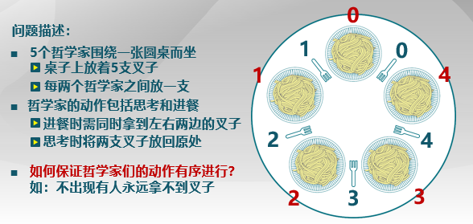

## 信号量（semaphore）

信号量是操作系统提供的一种**协调共享资源访问的方法**（其实现在已经很少用了），表示**系统资源的数量**

信号量的抽象数据类型

-   一个**整形(**sem),具有两个原子操作
-   P(): sem减一,如果sem<0,**等待,**否则继续
-   V(): sem加一,如果sem≤0,**唤醒**一个等待的P

### 信号量特性

1.信号量是**被保护的整数变量**

-   初始化完成后,唯一改变一个信号量的值的办法是通过P()和V()
-   操作系统保证**P、V是原子操作**

2.**P()可能阻塞,V()不会阻塞**

3.假定信号量是公平的

-   线程**不会无限期阻塞在P()操作**
-   在实践中,**FIFO**经常被使用

<font color='orange'>注意：**自旋锁**没有办法做到先进先出</font>（运气不好，资源空闲时这个线程去查的时候另一个已经查过了）

### 信号量分类

* **二进制信号量**：资源数目为0或1

* **资源信号量**：资源数目为任何非负数
* 上述两者等价

## 信号量使用

### 1.信号量实现互斥访问

```cpp
//每个临界区设置一个信号量，其初值为1
mutex = new Semaphore(1);

mutex->P();
Critical Section;
mutex->V();
```

必须**<font color='red'>成对使用</font>**P()操作和V()操作

* P保证互斥访问临界资源
* V保证使用后释放临界资源
* pv**不能次序错误、重复或遗漏**

### 2.信号量实现条件同步

```cpp
//每个条件同步设置一个信号量，其初值为0
condition = new Semaphore(0);

//Thread A
...
condition->P(); //等待线程B某一些指令完成之后再继续运行,在此阻塞
...

//Thread B
...
condition->V(); //信号量增加唤醒线程A
...
```

### 生产者-消费者问题


有界缓冲区的生产者-消费者问题

-   一个或者多个生产者产生数据将数据放在一个缓冲区里
-   单个消费者每次从缓冲区取出数据
-   在任何一个时间**只有一个生产者或消费者**可以访问该缓冲区

问题分析：

-   在任何一个时间只能有一个线程操作缓冲区(**互斥访问**)
-   当缓冲区为空时,消费者必须等待生产者(调度,**同步约束**)
-   当缓存区满,生产者必须等待消费者(调度,**同步约束**)

用信号量描述对应的每个约束：

-   二进制信号量mutex
-   一般信号量 fullBuffers
-   一般信号量 emptyBuffers

```cpp
class BoundedBuffer{
		mutex = new Semaphore(1);
		fullBuffers = new Semaphore(0);   //说明缓冲区初始为空，未满
 		emptyBuffers = new Semaphore(n);  //同时可以有n个生产者来生产，未空
};

BoundedBuffer::Deposit(c){
		emptyBuffers->P();//检查是否有空缓冲区
		mutex->P();//是否有另一个生产者或消费者访问缓冲区，即获取锁
    	//上述两步不能调换顺序，否则可能死锁
		Add c to the buffer;
		mutex->V();
		fullBuffers->V();
}

BoundedBuffer::Remove(c){
		fullBuffers->P();
		mutex->P();
		Remove c from buffer;
		mutex->V();
		emptyBuffers->V();
}
```

#### 使用信号量的困难

1. <font color='orange'>开发代码比较困难</font>
2. <font color='orange'>容易出错</font>
   * 使用的信号量已经被另一个线程占用
   * 忘记释放信号量
3. <font color='orange'>不能处理死锁问题</font>

## 管程

将配对的PV操作集中到一起

### 什么是管程

-   管程是一种用于多线程互斥访问共享资源的程序结构
    -   面向对象方法，简化同步控制
    -   任意时刻**只能一个线程访问**管程
    -   正在管程中的线程可**临时放弃管程的互斥访问**，等待事件出现时恢复

### 管程的组成

-   **一个锁**: 控制管程代码互斥访问
-   **0个或者多个条件变量**: 管理共享数据的并发访问

#### 条件变量（Condition Variable）

-   是管程内的等待机制
    -   进入管程的线程因资源被占用而进入等待状态
    -   **每个条件变量**表示一种等待原因，对应一个等待队列
-   Wait() 操作
    -   阻塞自己、唤醒一个等待着或者说**释放管程的互斥访问**
-   Signal() 操作
    -   唤醒等待队列的一个线程，如果等待队列为空，相当于一个空操作

##### 条件变量实现

-   需要维持每个条件队列
-   线程等待的条件等待signal()

```cpp
class Condition{
		int numWaiting = 0;
		WaitQueue q;
};

Condition::Wait(lock){
		numWaiting++;
		Add this thread t to q;
		release(lock);
		schedule(); //need mutex
		require(lock);
}

Condition::Signal(){
		if(numWaiting > 0){
				Remove a thread t from q;
				wakeup(t); //need mutex
				numWaiting--;
		}
}
```

管程解决生产者-消费者问题

```cpp
class BoundedBuffer{
		Lock lock;
		int count = 0;  //buffer缓冲区数据的数目
		Condition notFull, notEmpty;
};

BoundedBuffer::Deposit(c){
		lock->Acquire();    //管程的定义:只有一个线程能够进入管程
		while(count == n)
				notFull.Wait(&lock); //等待
		Add c to the buffer;
		count++;
		notEmpty.Signal();
		lock->Release();
}

BoundedBuffer::Remove(c){
		lock->Acquire();
		while(count == 0)
				notEmpty.Wait(&lock);
		Remove c from buffer;
		count--;
		notFull.Signal();
		lock->Release();
}
```

**<font color='red'>注</font>：**由于管程检查缓冲区不成功时，还可以**放弃**管程的互斥访问权限，故**可以先获取锁再判断缓冲区的空满**；而信号量进入临界区后在执行完之前没办法放弃，则它**只能先判断缓冲区**，不能调换这两者次序

##### 管程条件变量的释放处理方式


## 经典同步问题

### 读者-写者问题

两种类型的使用者: 

* 读者(不修改数据) 
* 写者(读取和修改数据)

问题的约束：共享数据的访问

-   **“读-读”允许**
-   **“读-写”互斥**
-   **“写-写”互斥**

用信号量描述约束：

-   信号量CountMutex
    * 控制读者计数的互斥修改
    * 初始化为1
-   信号量WriteMutex
    * 控制读写互斥
    * 初始化为1
-   读者计数Rcount
    * 记录正在读者数量
    * 初始化为0

#### 读者优先设计

只要有一个读者处于活动状态, 后来的读者都会被接纳

如果读者源源不断的出现,那么**写者持续处于阻塞状态**

```cpp
//信号量实现
//writer
P(WriteMutex);
write;
V(WriteMutex);

//reader
V(CountMutex);
if(Rcount == 0)
		P(WriteMutex); //确保后续不会有写者进入
++Rcount;
V(CountMutex);

read;

P(CountMutex);
--Rcount;
if(Rcount == 0)
		V(WriteMutex); //全部读者全部离开才能唤醒写者
V(CountMutex);
```

#### 写者优先设计

一旦写者就绪,那么写者会尽可能的执行写操作

如果写者源源不断的出现的话,那么**读者持续处于**阻塞状态

#### 用管程解决读者-写者问题

```cpp
//writer
Database::Write(){
		Wait until readers/writers;
		write database;
		check out - wake up waiting readers/writers;
}
//reader
Database::Read(){
		Wait until no writers;
		read database;
		check out - wake up waiting writers;
}

//管程实现
AR = 0; // # of active readers
AW = 0; // # of active writers
WR = 0; // # of waiting readers
WW = 0; // # of waiting writers
Condition okToRead;
Condition okToWrite;
Lock lock;
//写者优先
Public Database::Write(){
		//Wait until no readers/writers;
		StartWrite();
		write database;
		//check out - wake up waiting readers/writers;
		DoneWrite();
}

Private Database::StartWrite(){
		lock.Acquire();
		while((AW + AR) > 0){
				WW++;
				okToWrite.wait(&lock);
				WW--;		
		}
		AW++;
		lock.Release();
}

Private Database::DoneWrite(){
		lock.Acquire();
		AW--;
		if(WW > 0){
				okToWrite.signal();
		}
		else if(WR > 0){
				okToRead.broadcast(); //唤醒所有reader 
		}
		lock.Release();
}

//写者优先
Public Database::Read(){
		//Wait until no writers;
		StartRead();
		read database;
		//check out - wake up waiting writers;
		DoneRead();
}

Private Database::StartRead(){
		lock.Acquire();
		while(AW + WW > 0){    //关注等待的writer,体现出写者优先
				WR++;
				okToRead.wait(&lock);
				WR--;
		}
		AR++;
		lock.Release();
}

private Database::DoneRead(){
		lock.Acquire();
		AR--;
		if(AR == 0 && WW > 0){  //只有读者全部没有了,才需要唤醒
				okToWrite.signal();
		}
		lock.Release();
}
```

### 哲学家就餐问题



```cpp
#define   N   5                     // 哲学家个数
semaphore fork[5];                  // 信号量初值为1
semaphore   mutex;	                         // 互斥信号量，初值1

//方案一
//不正确，可能死锁，所有人都
void   philosopher(int   i)          // 哲学家编号：0 － 4
         while(TRUE){ 
            think( );                      // 哲学家在思考
			P(fork[i]);                   // 去拿左边的叉子
			P(fork[(i + 1) % N]);         // 去拿右边的叉子     
      		eat( );	                      // 吃面条中… 	
			V(fork[i]);                   // 放下左边的叉子
             V(fork[(i + 1) % N ]);       // 放下右边的叉子
    }

//方案二
//互斥访问正确，但效率低，每次只能一个人就餐
void   philosopher(int   i)               // 哲学家编号：0 － 4
    while(TRUE){
        think( );                                   // 哲学家在思考	
        P(mutex);                                   // 进入临界区	
        P(fork[i]);                               // 去拿左边的叉子
        P(fork[(i + 1) % N]);     // 去拿右边的叉子
        eat( );                                       // 吃面条中…. 	
        V(fork[i]);	                        // 放下左边的叉子
        V(fork[(i + 1) % N]);         // 放下右边的叉子
        V(mutex);                                  // 退出临界区	
    }

//方案三
//没有死锁，可多人就餐（这里也就是最多两人就餐）
void   philosopher(int   i)         // 哲学家编号：0 － 4
    while(TRUE)
    {
        think( );                   // 哲学家在思考
        if (i%2 == 0) {
            P(fork[i]);	      // 去拿左边的叉子
            P(fork[(i + 1) % N]);   // 去拿右边的叉子
        } else {
            P(fork[(i + 1) % N]);   // 去拿右边的叉子
            P(fork[i]);             // 去拿左边的叉子 
        }      
        eat( );                     // 吃面条中….
        V(fork[i]);		      // 放下左边的叉子
        V(fork[(i + 1) % N]);	      // 放下右边的叉子
    }
```

